# Mercari Price Suggestion Challenge
***
## Can you automatically suggest product prices to online sellers?


<b>Mercari</b> is biggest community - powered shopping app. The Mercari marketplace app allows users to buy and sell items quickly from their smartphones. Product pricing is a huge problem to them.

***

# Table Of Contents
***
### Business Problem
- [The business problem of Mercari](#problem)

### Objective
- [Goal of the notebook](#objective)

### Data Quality Check
- [Simple Inspection of Data](#inspection)

### Data Preprocessing
- [Data Cleansing](#cleansing)
- [Missing Values](#missingValues)
- [Imputation](#imputation)
- [Lowercase the string columns](#lowercase)
- [Data correction](#correction)

### Descriptive Statistics
- [Explore Data](#eda)
- [Price Distribution](#price)
- [Shipping Distribution](#shipping)
- [Item Condition Distribution](#itemCondition)
- [Category Distribution](#category)
- [Subcategory 1 Distribution](#subcategory1)
- [Subcategory 2 Distribution](#subcategory2)
- [Brand Distribution](#brand)

### Feature Engineering
- [Is Branded](#isBrand)
- [Item description and Name length](#itemDescription)
- [Unique word count on Item description and Name](#unique)

### Feature Extraction from text
- [TextPreprocessing](#textPreprocessing)
    - [Functions to normalize string](#functionsToNormalize)
    - [Normalize](#normalize)
- [Vectorization](#vectorization)
    - [Count Vectorizer](#count)
    - [Label Binarizer](#binarizer)
    - [TFIDF](#tfidf)
    
### Eli5
- [Eli5](#eli5)
- [Analyzing item description with eli5](#analyzingEli5)
- [Baseline Model with Count Vectorizer](#eli5Count)
- [Baseline Model with Count Vectorizer and Stop words](#eli5CountStop)
- [Baseline Model with TFIDF](#eli5Tfidf)
- [Baseline Model with TFIDF and Stop words](#eli5TfidfStop)
- [Baseline Model with TFIDF, Stop words and n-grams](#eli5TfidfStopNgrams)
- [RMSLE Summary](#eli5Rmsle)

### Encoding

### Merge the Sparse Matrices

### Train and Test Split

### Modelling
- [Define RMSLE fuction](#defineRMSLE)
- [Ridge Regression Cross Validation](#ridgeCV)
- [LGBM Cross Validation](#lgbmCV)
- [Ensemble](#ensemble)

### Save models to disk

### Predictions on Kaggle Test Dataset
- [Predictions by Ridge Model](#ridgePred)
- [Predictions by LGBM Model](#lgbmPred)
- [Predictions by Ensemble](#ensemblePred)

### Conclusion

***


<a id = 'problem'></a>
# Business problem
***
<b>Mercari</b> allows sellers to sell their products through their app. **The task of putting up the right/optimal price for the product** is left to the seller. **It is hard for a seller to estimate the right price**, considering just how many products are sold online. Clothing has strong seasonal pricing trends and is heavily influenced by brand names, while electronics have fluctuating prices based on product specs. Mercari knows this problem deeply. They’d like to offer pricing suggestions to sellers, but this is tough because their sellers are enabled to put just about anything, or any bundle of things, on Mercari's marketplace.

<a id = 'objective'></a>
# Objective
***
The objective is to come up with the right pricing algorithm that can provide a pricing recommendation to the users. This will allow the users to see a suggested price before purchasing or selling.

# Import packages
***


```python
import pandas as pd
import numpy as np
import matplotlib.pyplot as plt
import seaborn as sns
import gc
import time

import nltk
from string import punctuation
from nltk.corpus import stopwords
from nltk.stem.porter import PorterStemmer

from scipy.sparse import vstack, hstack, csr_matrix
from sklearn.feature_extraction.text import CountVectorizer, TfidfVectorizer
from sklearn.preprocessing import LabelBinarizer

from sklearn.metrics import mean_squared_error
from sklearn.pipeline import make_pipeline
from sklearn.model_selection import KFold, cross_val_score, train_test_split

from sklearn.linear_model import Ridge
import lightgbm as lgb

import warnings
warnings.filterwarnings('ignore')

%matplotlib inline
```

# Read the data
***


```python
# Create training set
train = pd.read_csv('../input/train.tsv', sep = '\t')
```


```python
# Create testing set
test = pd.read_csv('../input/test.tsv', sep = '\t',engine = 'python')
```

<a id = 'inspection'></a>
# Data Quality Check
***


```python
# Examine the train dataset
train.head()
```


<div>
<style scoped>
    .dataframe tbody tr th:only-of-type {
        vertical-align: middle;
    }

    .dataframe tbody tr th {
        vertical-align: top;
    }

    .dataframe thead th {
        text-align: right;
    }
</style>
<table border="1" class="dataframe">
  <thead>
    <tr style="text-align: right;">
      <th></th>
      <th>train_id</th>
      <th>name</th>
      <th>item_condition_id</th>
      <th>category_name</th>
      <th>brand_name</th>
      <th>price</th>
      <th>shipping</th>
      <th>item_description</th>
    </tr>
  </thead>
  <tbody>
    <tr>
      <th>0</th>
      <td>0</td>
      <td>MLB Cincinnati Reds T Shirt Size XL</td>
      <td>3</td>
      <td>Men/Tops/T-shirts</td>
      <td>NaN</td>
      <td>10.0</td>
      <td>1</td>
      <td>No description yet</td>
    </tr>
    <tr>
      <th>1</th>
      <td>1</td>
      <td>Razer BlackWidow Chroma Keyboard</td>
      <td>3</td>
      <td>Electronics/Computers &amp; Tablets/Components &amp; P...</td>
      <td>Razer</td>
      <td>52.0</td>
      <td>0</td>
      <td>This keyboard is in great condition and works ...</td>
    </tr>
    <tr>
      <th>2</th>
      <td>2</td>
      <td>AVA-VIV Blouse</td>
      <td>1</td>
      <td>Women/Tops &amp; Blouses/Blouse</td>
      <td>Target</td>
      <td>10.0</td>
      <td>1</td>
      <td>Adorable top with a hint of lace and a key hol...</td>
    </tr>
    <tr>
      <th>3</th>
      <td>3</td>
      <td>Leather Horse Statues</td>
      <td>1</td>
      <td>Home/Home Décor/Home Décor Accents</td>
      <td>NaN</td>
      <td>35.0</td>
      <td>1</td>
      <td>New with tags. Leather horses. Retail for [rm]...</td>
    </tr>
    <tr>
      <th>4</th>
      <td>4</td>
      <td>24K GOLD plated rose</td>
      <td>1</td>
      <td>Women/Jewelry/Necklaces</td>
      <td>NaN</td>
      <td>44.0</td>
      <td>0</td>
      <td>Complete with certificate of authenticity</td>
    </tr>
  </tbody>
</table>
</div>


```python
# Examine the test dataset
test.head()
```


<div>
<style scoped>
    .dataframe tbody tr th:only-of-type {
        vertical-align: middle;
    }

    .dataframe tbody tr th {
        vertical-align: top;
    }

    .dataframe thead th {
        text-align: right;
    }
</style>
<table border="1" class="dataframe">
  <thead>
    <tr style="text-align: right;">
      <th></th>
      <th>test_id</th>
      <th>name</th>
      <th>item_condition_id</th>
      <th>category_name</th>
      <th>brand_name</th>
      <th>shipping</th>
      <th>item_description</th>
    </tr>
  </thead>
  <tbody>
    <tr>
      <th>0</th>
      <td>0</td>
      <td>Breast cancer "I fight like a girl" ring</td>
      <td>1</td>
      <td>Women/Jewelry/Rings</td>
      <td>NaN</td>
      <td>1</td>
      <td>Size 7</td>
    </tr>
    <tr>
      <th>1</th>
      <td>1</td>
      <td>25 pcs NEW 7.5"x12" Kraft Bubble Mailers</td>
      <td>1</td>
      <td>Other/Office supplies/Shipping Supplies</td>
      <td>NaN</td>
      <td>1</td>
      <td>25 pcs NEW 7.5"x12" Kraft Bubble Mailers Lined...</td>
    </tr>
    <tr>
      <th>2</th>
      <td>2</td>
      <td>Coach bag</td>
      <td>1</td>
      <td>Vintage &amp; Collectibles/Bags and Purses/Handbag</td>
      <td>Coach</td>
      <td>1</td>
      <td>Brand new coach bag. Bought for [rm] at a Coac...</td>
    </tr>
    <tr>
      <th>3</th>
      <td>3</td>
      <td>Floral Kimono</td>
      <td>2</td>
      <td>Women/Sweaters/Cardigan</td>
      <td>NaN</td>
      <td>0</td>
      <td>-floral kimono -never worn -lightweight and pe...</td>
    </tr>
    <tr>
      <th>4</th>
      <td>4</td>
      <td>Life after Death</td>
      <td>3</td>
      <td>Other/Books/Religion &amp; Spirituality</td>
      <td>NaN</td>
      <td>1</td>
      <td>Rediscovering life after the loss of a loved o...</td>
    </tr>
  </tbody>
</table>
</div>


```python
# Check the type of our features. Are there any data inconsistencies?
train.dtypes
```


    train_id               int64
    name                  object
    item_condition_id      int64
    category_name         object
    brand_name            object
    price                float64
    shipping               int64
    item_description      object
    dtype: object


```python
# Can you check to see if there are any missing values in our train data set
train.isnull().any()
```


    train_id             False
    name                 False
    item_condition_id    False
    category_name         True
    brand_name            True
    price                False
    shipping             False
    item_description      True
    dtype: bool


```python
# Can you check to see if there are any missing values in our test data set
test.isnull().any()
```


    test_id              False
    name                 False
    item_condition_id    False
    category_name         True
    brand_name            True
    shipping             False
    item_description     False
    dtype: bool


```python
# What is the size of the training set?
train.shape
```


    (1482535, 8)


```python
# What is the size of the test set?
test.shape
```


    (693359, 7)


```python
# Function to create combined set. 
# You would want to apply count vectorizer on combined set so you can get the list of all possible words.
def combineTrainTestSet():
    all_data = pd.concat((train.drop(['train_id', 'price'], axis = 1),
                          test.drop(['test_id'], axis = 1))).reset_index(drop=True)

    # Create the submission set (Only contains the test ID)
    submission = test[['test_id']]

    # size of train
    train_size = len(train)
    
    return (all_data, submission, train_size)
```

# Data Preprocessing
***

<a id = 'cleansing'></a>
## Data Cleansing
***

### Data with 0 price
***


```python
# check data that has price set to 0
print("Count of records with 0 prices: ", train[train['price'] == 0].shape[0])
```

    Count of records with 0 prices:  874


```python
# deleting all records that has 0 price
train = train[train['price'] != 0].reset_index()
```

***


```python
# Combine train and test dataset
all_data, submission, train_size = combineTrainTestSet()
```

<a id = 'missingValues'></a>
## Missing values
***


```python
missing_total = all_data.isnull().sum().sort_values(ascending=False)
percent = (all_data.isnull().sum() * 100/all_data.isnull().count()).sort_values(ascending=False)
missing_data = pd.concat([missing_total, percent], axis=1, keys=['Total', 'Percent'])
missing_data[missing_data['Percent'] > 0]['Percent'].plot.bar(by = 'Percent', figsize=(6,4))
```


    <matplotlib.axes._subplots.AxesSubplot at 0x1a18450400>


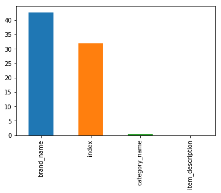


<a id = 'imputation'></a>
## Imputation
***


```python
# Imputing missing values of brand name with "unbranded"
all_data['brand_name'] = all_data['brand_name'].fillna('unbranded')

# Imputing missing values of category_name with "other"
all_data['category_name'] = all_data['category_name'].fillna('other/other/other')

# Imputing missing values of item_description with "none"
all_data['item_description'] = all_data['item_description'].fillna('none')
```

<a id = 'lowercase'></a>
## Lowercase all string columns
***
Updating cases of all string values to lowercases


```python
all_data['name'] = all_data['name'].str.lower()
all_data['category_name'] = all_data['category_name'].str.lower()
all_data['brand_name'] = all_data['brand_name'].str.lower()
all_data['item_description'] = all_data['item_description'].str.lower()
```

<a id = 'correction'></a>
## Data Correction
***


```python
# Some item_description have values "no description yet" and some have "no description".
# Replacing them with "none"
all_data['item_description'] = all_data['item_description'].apply(lambda x: 'none' 
                                                                  if x == 'no description yet' else x)
all_data['item_description'] = all_data['item_description'].apply(lambda x: 'none' 
                                                                  if x == 'no description' else x)
```

*We are doing a minor **feature engineering** here. The category name is of the form **General category/Subcategory1/Subcategory2**. We will split it to three different columns: "category_main", "category_sub1" and "category_sub2".*


```python
# The category name is of the form "General category/Subcategory1/Subcategory2"
# Let us segregate it in 3 columns
def segregate_category(text):
    try: return text.split("/")
    except: return ("other", "other", "other")
```


```python
all_data['category_main'], all_data['category_sub1'], all_data['category_sub2'] = zip(*all_data['category_name'].apply(segregate_category))
```

We have values **other** in our subcategory columns category_sub1 and category_sub2. However, "women/other" is very different from "men/other". Similarly, "women/other/other" is very different than "men/other/other". Let us make correction to this.

### Example:

**Before transformation:**

| category_main | category_sub1 | category_sub2 |
| ------------- | ------------- | ------------- |
| women         | skirt         | other         |
| women         | other         | other         |
| men           | shirt         | other         |
| men           | other         | other         |
| other         | other         | other         |

**After transformation:**

| category_main | category_sub1 | category_sub2 |
| --- | --- | --- |
| women | skirt | skirt |
| women | women | women |
| men | shirt | shirt |
| men | men | men |
| other | other | other |


```python
all_data.loc[all_data['category_sub1']=='other', 'category_sub1'] = all_data['category_main']
all_data.loc[all_data['category_sub2']=='other', 'category_sub2'] = all_data['category_sub1']
```

***


```python
# Function to update changes in train and test set
def updateTrainTestDataset():
    global train
    global test
    ntrain = train.shape[0]
    ntest = test.shape[0]

    label = train['price']

    train = all_data[:ntrain]
    train['price'] = label
    test = all_data[ntrain:].reset_index().drop(['index'], axis = 1)
```


```python
updateTrainTestDataset()
```

<a id = 'eda'></a>
# Exploratory Data Analysis
***


```python
# Display the statistical overview of the categorical attributes
all_data.astype('object').describe().transpose()
```


<div>
<style scoped>
    .dataframe tbody tr th:only-of-type {
        vertical-align: middle;
    }

    .dataframe tbody tr th {
        vertical-align: top;
    }

    .dataframe thead th {
        text-align: right;
    }
</style>
<table border="1" class="dataframe">
  <thead>
    <tr style="text-align: right;">
      <th></th>
      <th>count</th>
      <th>unique</th>
      <th>top</th>
      <th>freq</th>
    </tr>
  </thead>
  <tbody>
    <tr>
      <th>brand_name</th>
      <td>2175020</td>
      <td>5288</td>
      <td>unbranded</td>
      <td>927861</td>
    </tr>
    <tr>
      <th>category_name</th>
      <td>2175020</td>
      <td>1310</td>
      <td>women/athletic apparel/pants, tights, leggings</td>
      <td>88052</td>
    </tr>
    <tr>
      <th>index</th>
      <td>1.48166e+06</td>
      <td>1.48166e+06</td>
      <td>1.48253e+06</td>
      <td>1</td>
    </tr>
    <tr>
      <th>item_condition_id</th>
      <td>2175020</td>
      <td>5</td>
      <td>1</td>
      <td>940327</td>
    </tr>
    <tr>
      <th>item_description</th>
      <td>2175020</td>
      <td>1850297</td>
      <td>none</td>
      <td>120970</td>
    </tr>
    <tr>
      <th>name</th>
      <td>2175020</td>
      <td>1617196</td>
      <td>bundle</td>
      <td>4116</td>
    </tr>
    <tr>
      <th>shipping</th>
      <td>2175020</td>
      <td>2</td>
      <td>0</td>
      <td>1201805</td>
    </tr>
    <tr>
      <th>category_main</th>
      <td>2175020</td>
      <td>10</td>
      <td>women</td>
      <td>974038</td>
    </tr>
    <tr>
      <th>category_sub1</th>
      <td>2175020</td>
      <td>121</td>
      <td>athletic apparel</td>
      <td>196975</td>
    </tr>
    <tr>
      <th>category_sub2</th>
      <td>2175020</td>
      <td>950</td>
      <td>t-shirts</td>
      <td>90289</td>
    </tr>
  </tbody>
</table>
</div>


<b> Observations: </b>
1. There are approximately 121k, i.e., 5.5% of products with no item description.
2. There are 5287 unique brands and Nike being the most occuring brand with near 79k products.
3. There are 927861 products (42%) with missing brand value, which supposedly mean they are unbranded.
4. Majority of items sold on Mercari are women's.
5. 1201805 (44.74%) of shipping prices were paid by buyers, and remaining 973530 (55.25%) of the times, shipping prices were paid by the seller.
6. T-shirts are most sold products in Mercari.


```python
# Display the statistical overview of the numerical attributes
all_data.describe().transpose()
```


<div>
<style scoped>
    .dataframe tbody tr th:only-of-type {
        vertical-align: middle;
    }

    .dataframe tbody tr th {
        vertical-align: top;
    }

    .dataframe thead th {
        text-align: right;
    }
</style>
<table border="1" class="dataframe">
  <thead>
    <tr style="text-align: right;">
      <th></th>
      <th>count</th>
      <th>mean</th>
      <th>std</th>
      <th>min</th>
      <th>25%</th>
      <th>50%</th>
      <th>75%</th>
      <th>max</th>
    </tr>
  </thead>
  <tbody>
    <tr>
      <th>index</th>
      <td>1481661.0</td>
      <td>741243.718093</td>
      <td>427971.458448</td>
      <td>0.0</td>
      <td>370588.0</td>
      <td>741238.0</td>
      <td>1111877.0</td>
      <td>1482534.0</td>
    </tr>
    <tr>
      <th>item_condition_id</th>
      <td>2175020.0</td>
      <td>1.906933</td>
      <td>0.903240</td>
      <td>1.0</td>
      <td>1.0</td>
      <td>2.0</td>
      <td>3.0</td>
      <td>5.0</td>
    </tr>
    <tr>
      <th>shipping</th>
      <td>2175020.0</td>
      <td>0.447451</td>
      <td>0.497231</td>
      <td>0.0</td>
      <td>0.0</td>
      <td>0.0</td>
      <td>1.0</td>
      <td>1.0</td>
    </tr>
  </tbody>
</table>
</div>


## Target variable: Price
***


```python
# Display the statistic overview of target variable 'price'
train.price.describe()
```


    count    1.481661e+06
    mean     2.675329e+01
    std      3.859198e+01
    min      3.000000e+00
    25%      1.000000e+01
    50%      1.700000e+01
    75%      2.900000e+01
    max      2.009000e+03
    Name: price, dtype: float64


```python
#histogram
sns.distplot(train['price'])
```


    <matplotlib.axes._subplots.AxesSubplot at 0x1ac017ad68>


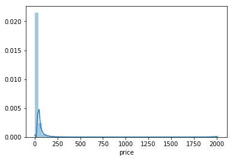


<a id = 'price'></a>
## Price Distribution
***

**Summary**
1. The min value of price is 0. There are 874 products for 0 dollars.
2. The mean price is 26.7 dollars.
3. The median price is 17 dollars.
2. The third quartile of the price is on 29 dollars, while the max value is 2009 dollars. Thats a huge difference.
3. The price is highly skewed.
3. Only 2.82% of products have its price higher than 100 currency value.

**Actions to take**
<br>
Log transformation has to be applied on price.

**Why log transformation?**
<br>
The price distribution is highly skewed, e.g., only 2.8% of data is more than 100 dollars and the max value is 2009 dollars. This reduces the relevance of the errors (in the predicted value) on lower prices. Log transformation converges the distribution to a smaller scale, which means that the difference between different values of price will reduce. This, in turn, would make the distribution more normal.

**Procedure**

**Step 1 Log Transformation:** np.log(train['price']+1)

**Step 2 Predict with Log Transformation:** test_pred = model.predict(X_test)

**Step 3 Convert back to original value by Exponential Transformation** Y_test = np.expm1(test_pred)


```python
# Plot Price Distribution
plt.subplot(1, 2, 1)
(train['price']).plot.hist(bins=50, figsize=(15, 6), edgecolor = 'white', range = [0, 250])
plt.xlabel('price', fontsize=12)
plt.title('Price Distribution', fontsize=12)

#Plot Log Price Distribution
plt.subplot(1, 2, 2)
np.log(train['price']+1).plot.hist(bins=50, figsize=(15,6), edgecolor='white')
plt.xlabel('log(price+1)', fontsize=12)
plt.title('Log Price Distribution', fontsize=12)

plt.show()
```


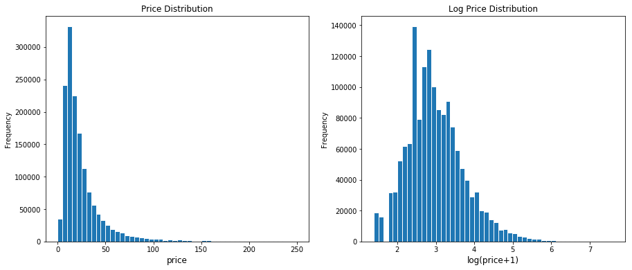


```python
y_train = np.log1p(train['price'])
```

# Shipping
***


```python
all_data['shipping'].value_counts() / len(all_data)
```


    0    0.552549
    1    0.447451
    Name: shipping, dtype: float64


```python
all_data['shipping'].value_counts().plot.bar()
```


    <matplotlib.axes._subplots.AxesSubplot at 0x1abd716f60>


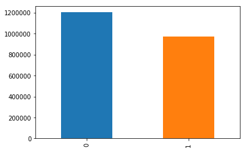


**Observations:**
55% of times sellers paid the shipping charges.

## Price Distribution by Shipping Type
***
**Hypothesis**
I have an intution that the product charges are higher when sellers pay the shipping charges. Let's see if it holds true.


```python
shipping_fee_by_buyer = train.loc[train['shipping'] == 0, 'price']
shipping_fee_by_seller = train.loc[train['shipping'] == 1, 'price']

fig, ax = plt.subplots(figsize=(18,8))

ax.hist(shipping_fee_by_seller, color='blue', alpha=1.0, bins=50, range = [0, 100],label='Price when Seller pays Shipping')
ax.hist(shipping_fee_by_buyer, color='red', alpha=0.7, bins=50, range = [0, 100],label='Price when Buyer pays Shipping')

plt.xlabel('price', fontsize=12)
plt.ylabel('frequency', fontsize=12)
plt.title('Price Distribution by Shipping Type', fontsize=15)
plt.tick_params(labelsize=12)
plt.legend()
plt.show()
```


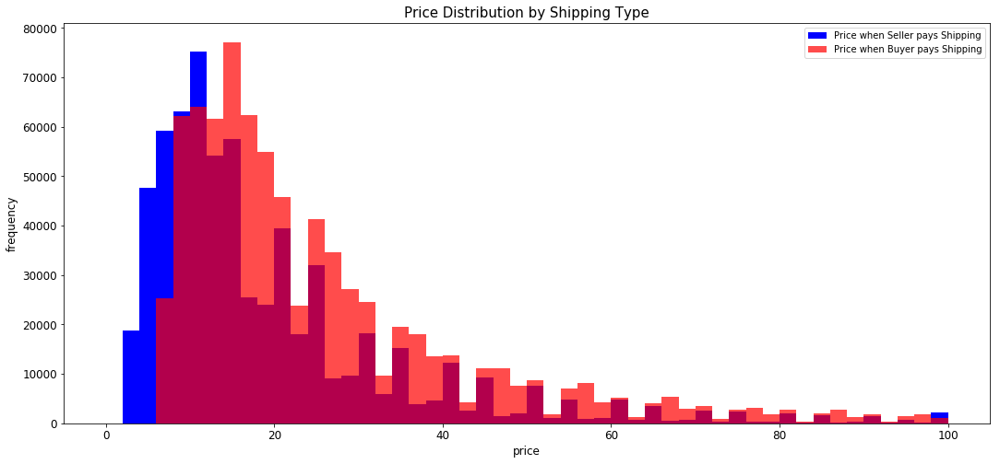


## Average price for Shipping type
***


```python
print('The average price is {}'.format(round(shipping_fee_by_seller.mean(), 2)), 'if seller pays shipping')
print('The average price is {}'.format(round(shipping_fee_by_buyer.mean(), 2)), 'if buyer pays shipping')
```

    The average price is 22.58 if seller pays shipping
    The average price is 30.13 if buyer pays shipping


**Observations:**
<br>
Mostly for low priced items, shipping does increase the product charges. However, for most of the products which are priced more than 15 dollars, our hypothesis doesn't hold true

<a id = 'itemCondition'></a>
## Item Condition
***


```python
all_data['item_condition_id'].value_counts() / len(all_data)
```


    1    0.432330
    3    0.291292
    2    0.253216
    4    0.021516
    5    0.001646
    Name: item_condition_id, dtype: float64


```python
all_data['item_condition_id'].value_counts().plot.bar()
```


    <matplotlib.axes._subplots.AxesSubplot at 0x1ab5c15a90>


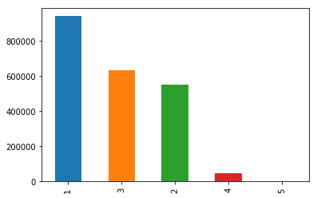


**Observations:**
<br>
There are only 2% of products with condition as bad as 4 or 5.

<a id = 'category'></a>
## Category
***


```python
all_data['category_main'].value_counts()
```


    women                     974038
    beauty                    304990
    kids                      251780
    electronics               180311
    men                       137675
    home                       99797
    other                      76110
    vintage & collectibles     67929
    handmade                   45170
    sports & outdoors          37220
    Name: category_main, dtype: int64


```python
all_data['category_main'].value_counts().plot.bar()
```


    <matplotlib.axes._subplots.AxesSubplot at 0x1aae6c6f28>


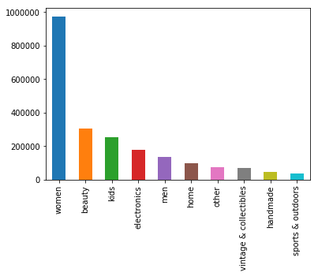


**Observations:**
<br>
44% of products sold in Mercari come under the category "women", whereas only 6% of products are "men's".

## Category versus Price
***


```python
# plot
sns.set_style('ticks')
fig, ax = plt.subplots()
# the size of A4 paper
fig.set_size_inches(11.7, 8.27)

sns.boxplot(
    x='category_main',
    y='price',
    data=train[train['price'] < 60],
    ax = ax
)
```


    <matplotlib.axes._subplots.AxesSubplot at 0x1aacf02470>


<a id = 'subcategory1'></a>
## Subcategory 1
***
There are 121 unique values of subcategory 1. Let's explore top 20 ones.


```python
top_20_subcategory1 = all_data['category_sub1'].value_counts()[:20].reset_index()
top_20_subcategory1
```


<div>
<style scoped>
    .dataframe tbody tr th:only-of-type {
        vertical-align: middle;
    }

    .dataframe tbody tr th {
        vertical-align: top;
    }

    .dataframe thead th {
        text-align: right;
    }
</style>
<table border="1" class="dataframe">
  <thead>
    <tr style="text-align: right;">
      <th></th>
      <th>index</th>
      <th>category_sub1</th>
    </tr>
  </thead>
  <tbody>
    <tr>
      <th>0</th>
      <td>athletic apparel</td>
      <td>196975</td>
    </tr>
    <tr>
      <th>1</th>
      <td>makeup</td>
      <td>182992</td>
    </tr>
    <tr>
      <th>2</th>
      <td>tops &amp; blouses</td>
      <td>157201</td>
    </tr>
    <tr>
      <th>3</th>
      <td>shoes</td>
      <td>147139</td>
    </tr>
    <tr>
      <th>4</th>
      <td>jewelry</td>
      <td>90352</td>
    </tr>
    <tr>
      <th>5</th>
      <td>toys</td>
      <td>85184</td>
    </tr>
    <tr>
      <th>6</th>
      <td>cell phones &amp; accessories</td>
      <td>78249</td>
    </tr>
    <tr>
      <th>7</th>
      <td>women's handbags</td>
      <td>67221</td>
    </tr>
    <tr>
      <th>8</th>
      <td>dresses</td>
      <td>67220</td>
    </tr>
    <tr>
      <th>9</th>
      <td>women's accessories</td>
      <td>62032</td>
    </tr>
    <tr>
      <th>10</th>
      <td>jeans</td>
      <td>53050</td>
    </tr>
    <tr>
      <th>11</th>
      <td>video games &amp; consoles</td>
      <td>53001</td>
    </tr>
    <tr>
      <th>12</th>
      <td>sweaters</td>
      <td>52274</td>
    </tr>
    <tr>
      <th>13</th>
      <td>underwear</td>
      <td>49734</td>
    </tr>
    <tr>
      <th>14</th>
      <td>skin care</td>
      <td>43667</td>
    </tr>
    <tr>
      <th>15</th>
      <td>home décor</td>
      <td>36992</td>
    </tr>
    <tr>
      <th>16</th>
      <td>fragrance</td>
      <td>35817</td>
    </tr>
    <tr>
      <th>17</th>
      <td>kitchen &amp; dining</td>
      <td>32432</td>
    </tr>
    <tr>
      <th>18</th>
      <td>tops</td>
      <td>30344</td>
    </tr>
    <tr>
      <th>19</th>
      <td>swimwear</td>
      <td>27779</td>
    </tr>
  </tbody>
</table>
</div>


```python
list(top_20_subcategory1['index'])[0:10]
```


    ['athletic apparel',
     'makeup',
     'tops & blouses',
     'shoes',
     'jewelry',
     'toys',
     'cell phones & accessories',
     "women's handbags",
     'dresses',
     "women's accessories"]


```python
sns.set(style='whitegrid')

# Initialize the matplotlib figure
f, ax = plt.subplots(figsize=(15, 8))

sns.barplot(x='category_sub1', y='index', data=top_20_subcategory1, label='# Item per category', color='g')

# Add a legend and informative axis label
ax.set( ylabel="Sub Category 1", title='# Item Per Category',
       xlabel="# of Items")

plt.show()
```


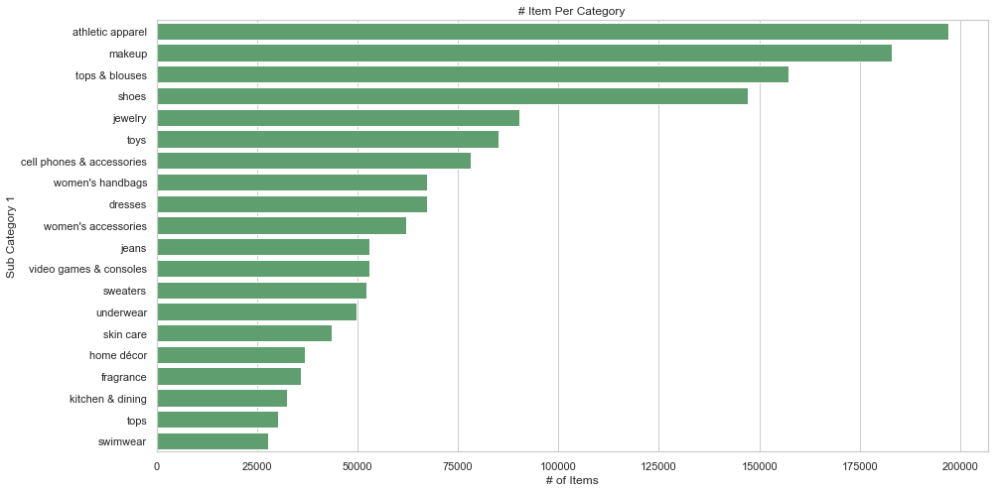


<a id = 'subcategory2'></a>
## Subcategory 2
***
There are 950 unique values of subcategory 2. Let's explore top 20 ones.


```python
top_20_subcategory2 = all_data['category_sub2'].value_counts()[:20].reset_index()
top_20_subcategory2
```


<div>
<style scoped>
    .dataframe tbody tr th:only-of-type {
        vertical-align: middle;
    }

    .dataframe tbody tr th {
        vertical-align: top;
    }

    .dataframe thead th {
        text-align: right;
    }
</style>
<table border="1" class="dataframe">
  <thead>
    <tr style="text-align: right;">
      <th></th>
      <th>index</th>
      <th>category_sub2</th>
    </tr>
  </thead>
  <tbody>
    <tr>
      <th>0</th>
      <td>t-shirts</td>
      <td>90289</td>
    </tr>
    <tr>
      <th>1</th>
      <td>pants, tights, leggings</td>
      <td>88052</td>
    </tr>
    <tr>
      <th>2</th>
      <td>face</td>
      <td>73519</td>
    </tr>
    <tr>
      <th>3</th>
      <td>shoes</td>
      <td>48207</td>
    </tr>
    <tr>
      <th>4</th>
      <td>lips</td>
      <td>45456</td>
    </tr>
    <tr>
      <th>5</th>
      <td>games</td>
      <td>45448</td>
    </tr>
    <tr>
      <th>6</th>
      <td>athletic</td>
      <td>39671</td>
    </tr>
    <tr>
      <th>7</th>
      <td>women</td>
      <td>38530</td>
    </tr>
    <tr>
      <th>8</th>
      <td>eyes</td>
      <td>38382</td>
    </tr>
    <tr>
      <th>9</th>
      <td>cases, covers &amp; skins</td>
      <td>36078</td>
    </tr>
    <tr>
      <th>10</th>
      <td>shorts</td>
      <td>32078</td>
    </tr>
    <tr>
      <th>11</th>
      <td>bras</td>
      <td>31331</td>
    </tr>
    <tr>
      <th>12</th>
      <td>tank, cami</td>
      <td>29897</td>
    </tr>
    <tr>
      <th>13</th>
      <td>blouse</td>
      <td>29805</td>
    </tr>
    <tr>
      <th>14</th>
      <td>above knee, mini</td>
      <td>29568</td>
    </tr>
    <tr>
      <th>15</th>
      <td>boots</td>
      <td>29488</td>
    </tr>
    <tr>
      <th>16</th>
      <td>necklaces</td>
      <td>28918</td>
    </tr>
    <tr>
      <th>17</th>
      <td>makeup palettes</td>
      <td>27983</td>
    </tr>
    <tr>
      <th>18</th>
      <td>shirts &amp; tops</td>
      <td>24733</td>
    </tr>
    <tr>
      <th>19</th>
      <td>shoulder bag</td>
      <td>22559</td>
    </tr>
  </tbody>
</table>
</div>


```python
sns.set(style='whitegrid')

# Initialize the matplotlib figure
f, ax = plt.subplots(figsize=(15, 8))

sns.barplot(x='category_sub2', y='index', data=top_20_subcategory2, label='# Item per category', color='orange')

# Add a legend and informative axis label
ax.set( ylabel="Sub Category 2", title='# Item Per Category',
       xlabel="# of Items")

plt.show()
```


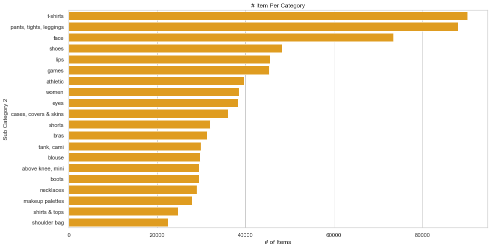


<a id = 'brand'></a>
## Brand
***
There are 5290 unique brands in complete dataset. However, the training set only have 4810 brands.


```python
# Amount of unique brand names
all_data['brand_name'].nunique()
```


    5288


```python
# Amount of unique brand names in training set
train['brand_name'].nunique()
```


    4808


```python
# Top 20 Brand Distribution
b20 = all_data['brand_name'].value_counts()[1:20].reset_index().rename(columns={'index': 'brand_name', 'brand_name':'count'})
ax = sns.barplot(x="brand_name", y="count", data=b20)
ax.set_xticklabels(ax.get_xticklabels(),rotation=90)
ax.set_title('Top 20 Brand Distribution', fontsize=15)
plt.show()
```


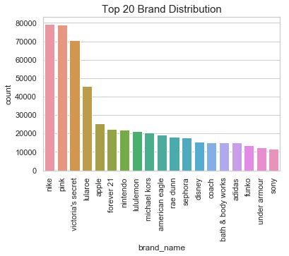


**Observations:**
<br>
1. There are 5290 unique brands in complete dataset, while there are only 4810 of them in training dataset.
1. There are 928207 products (42%) which are either unbranded or of unknown brand.
2. Nike and Pink are the top brands whose products are sold in Mercari.

### Brand versus Price
***


```python
# Top 20 expensive brands
top_20_exp_brand = pd.DataFrame(train.groupby(['brand_name'],as_index=True).std().price.sort_values(ascending=False)[0:20]).reset_index()
ax = sns.barplot(x="brand_name", y="price", data=top_20_exp_brand)
ax.set_xticklabels(ax.get_xticklabels(),rotation=90)
ax.set_title('Top 20 Expensive Brand Distribution', fontsize=15)
plt.show()
```


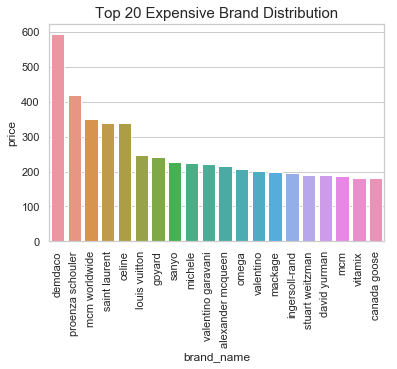


# Feature Engineering
***

<a id = 'isBrand'></a>
## Is Branded
***
Let us make a new feature "is_branded". If the item is of any known brand, we will update it with 1, otherwise 0.


```python
all_data.loc[(all_data.brand_name != 'unbranded'),'is_branded'] = 1
all_data.loc[(all_data.brand_name == 'unbranded'),'is_branded'] = 0
updateTrainTestDataset()
```

### Is Branded distribution
***


```python
all_data['is_branded'].value_counts().plot.bar()
```


    <matplotlib.axes._subplots.AxesSubplot at 0x1aaa302e80>


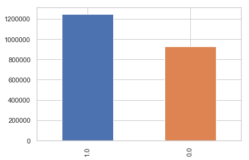


### Is branded versus price
***


```python
# plot
sns.set_style('ticks')
fig, ax = plt.subplots()
# the size of A4 paper
fig.set_size_inches(6, 5)

sns.boxplot(
    x='is_branded',
    y='price',
    data=train[train['price'] < 60],
    ax = ax
)
```


    <matplotlib.axes._subplots.AxesSubplot at 0x1ab2d0d4e0>


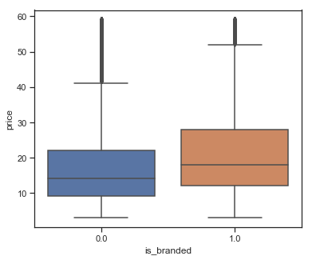


<a id = 'itemDescription'></a>
## Item Description and Name length
***
Does the length of description and name have some affect on pricing?


```python
description_length = all_data['item_description'].astype(str).apply(lambda x : len(str(x)))
name_length = all_data['name'].astype(str).apply(lambda x : len(str(x)))
all_data['length'] = description_length + name_length
updateTrainTestDataset()
```

### Description length versus price
***


```python
df = train.groupby('length')['price'].mean().reset_index()
sns.regplot(x=df["length"], y=(df["price"]))
plt.xlabel("word count")
plt.show()
```


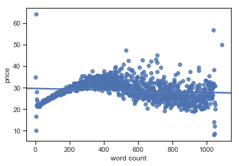


<a id = 'unique'></a>
## Unique word count on Item Description and Name
***


```python
def count_unique(text):
    text_list = text.split()
    return len(set(text_list))

description_unique = all_data['item_description'].astype(str).apply(lambda x : count_unique(str(x)))
name_unique = all_data['name'].astype(str).apply(lambda x : count_unique(str(x)))
all_data['unique'] = description_unique + name_unique
updateTrainTestDataset()
```

### Count of unique words in description versus price
***


```python
df = train.groupby('unique')['price'].mean().reset_index()
sns.regplot(x=df["unique"], y=(df["price"]))
plt.xlabel("unique word count")
plt.show()
```


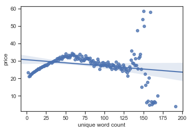


<a id = 'textPreprocessing'></a>
# Feature Extraction from Text
***


## Text pre-processing
The texts has to be normalised. We will be performing following steps:
- **Removing Punctuations**
- **Removing Digits**
- **Removing Stop Words**
- **Lowercasing the Words**
- **Lemmatization:** Words in third person are changed to first person, and verbs in past and present tenses are changed changed to present.
- **Stemming:** Words are reduced to their root form
- **Tokenization:** Split the text into sentences and the sentences into words. Lowercase the words and remove punctuation.

## Bag of Words

If we want to use text in Machine Learning algorithms, we’ll have to convert them to a numerical representation. It should be no surprise that computers are very well at handling numbers. So, we convert text to a numerical representation called a feature vector. A feature vector can be as simple as a list of numbers.
<br>
The **bag-of-words model** is one of the feature extraction algorithms for text. The bag of words model **ignores grammar and order of words**.
- In python, we use **CountVectorizer**, **LabelBinarizer** and **TFIDF** are some ways of **vectorizing** texts.
- To preserve some ordering of text, we can introduce **n-grams** into our vectorization of words.


```python
# generating list of stop words
stop = stopwords.words('english')
stop
```


    ['i',
     'me',
     'my',
     'myself',
     'we',
     'our',
     'ours',
     'ourselves',
     'you',
     "you're",
     "you've",
     "you'll",
     "you'd",
     'your',
     'yours',
     'yourself',
     'yourselves',
     'he',
     'him',
     'his',
     'himself',
     'she',
     "she's",
     'her',
     'hers',
     'herself',
     'it',
     "it's",
     'its',
     'itself',
     'they',
     'them',
     'their',
     'theirs',
     'themselves',
     'what',
     'which',
     'who',
     'whom',
     'this',
     'that',
     "that'll",
     'these',
     'those',
     'am',
     'is',
     'are',
     'was',
     'were',
     'be',
     'been',
     'being',
     'have',
     'has',
     'had',
     'having',
     'do',
     'does',
     'did',
     'doing',
     'a',
     'an',
     'the',
     'and',
     'but',
     'if',
     'or',
     'because',
     'as',
     'until',
     'while',
     'of',
     'at',
     'by',
     'for',
     'with',
     'about',
     'against',
     'between',
     'into',
     'through',
     'during',
     'before',
     'after',
     'above',
     'below',
     'to',
     'from',
     'up',
     'down',
     'in',
     'out',
     'on',
     'off',
     'over',
     'under',
     'again',
     'further',
     'then',
     'once',
     'here',
     'there',
     'when',
     'where',
     'why',
     'how',
     'all',
     'any',
     'both',
     'each',
     'few',
     'more',
     'most',
     'other',
     'some',
     'such',
     'no',
     'nor',
     'not',
     'only',
     'own',
     'same',
     'so',
     'than',
     'too',
     'very',
     's',
     't',
     'can',
     'will',
     'just',
     'don',
     "don't",
     'should',
     "should've",
     'now',
     'd',
     'll',
     'm',
     'o',
     're',
     've',
     'y',
     'ain',
     'aren',
     "aren't",
     'couldn',
     "couldn't",
     'didn',
     "didn't",
     'doesn',
     "doesn't",
     'hadn',
     "hadn't",
     'hasn',
     "hasn't",
     'haven',
     "haven't",
     'isn',
     "isn't",
     'ma',
     'mightn',
     "mightn't",
     'mustn',
     "mustn't",
     'needn',
     "needn't",
     'shan',
     "shan't",
     'shouldn',
     "shouldn't",
     'wasn',
     "wasn't",
     'weren',
     "weren't",
     'won',
     "won't",
     'wouldn',
     "wouldn't"]


```python
# generating list of punctuation marks
punctuation_symbols = []
for symbol in punctuation:
    punctuation_symbols.append((symbol, ''))
punctuation_symbols
```


    [('!', ''),
     ('"', ''),
     ('#', ''),
     ('$', ''),
     ('%', ''),
     ('&', ''),
     ("'", ''),
     ('(', ''),
     (')', ''),
     ('*', ''),
     ('+', ''),
     (',', ''),
     ('-', ''),
     ('.', ''),
     ('/', ''),
     (':', ''),
     (';', ''),
     ('<', ''),
     ('=', ''),
     ('>', ''),
     ('?', ''),
     ('@', ''),
     ('[', ''),
     ('\\', ''),
     (']', ''),
     ('^', ''),
     ('_', ''),
     ('`', ''),
     ('{', ''),
     ('|', ''),
     ('}', ''),
     ('~', '')]


<a id = 'functionsToNormalize'></a>
### Functions to normalize string
***


```python
import string

# Function to remove punctuations
def remove_punctuation(sentence: str) -> str:
    return sentence.translate(str.maketrans('', '', string.punctuation))

# Function to remove stop words
def remove_stop_words(x):
    x = ' '.join([i for i in x.lower().split(' ') if i not in stop])
    return x

# Function to remove digits
def remove_digits(x):
    x = ''.join([i for i in x if not i.isdigit()])
    return x
```

<a id = 'normalize'></a>
### Normalize
***


```python
# Stem the Words
porter = PorterStemmer()
all_data['item_description'] = all_data['item_description'].apply(porter.stem)

all_data['item_description'] = all_data['item_description'].apply(remove_punctuation)
all_data['item_description'] = all_data['item_description'].apply(remove_stop_words)
all_data['item_description'] = all_data['item_description'].apply(remove_digits)

all_data['name'] = all_data['name'].apply(remove_punctuation)
all_data['name'] = all_data['name'].apply(remove_stop_words)
all_data['name'] = all_data['name'].apply(remove_digits)

updateTrainTestDataset()
```

<a id = 'vectorization'></a>
## Vectorization
***
Vectorization of string columns in dataframe can be done in threee different ways:
- Frequency Weight
- TF-IDF Weight
- Binary

**CountVectorizer**: Returns an encoded vector with integer count for each word

**TF-IDF(min_df, max_df, n-gram)**: Returns encoded vector with weighted count for each word (utilizes the word in the document in corresponsdence to the whole corpus, to keep it short, more emphasis on the rarity of a word).  This is good because we want to find frequent terms from that document that isn't so frequent within the whole document corpus.

**LabelBinarizer**: Get's all the word and assigns it to its own column. 0 means it's there and 1 means not (example with brand names)

<a id = 'count'></a>
## Count Vectorizer
***


```python
# CountVectorizer - name & categories
cv = CountVectorizer(min_df=10)
X_name = cv.fit_transform(all_data['name'])
X_category_main = cv.fit_transform(all_data['category_main'])
X_category_sub1 = cv.fit_transform(all_data['category_sub1'])
X_category_sub2 = cv.fit_transform(all_data['category_sub2'])
```


```python
print("Item Name Shape: " + str(X_name.shape))
print("Category Main Shape: " + str(X_category_main.shape))
print("Category Sub1 Shape: " + str(X_category_sub1.shape))
print("Category Sub2 Shape: " + str(X_category_sub2.shape))
```

    Item Name Shape: (2175020, 20477)
    Category Main Shape: (2175020, 12)
    Category Sub1 Shape: (2175020, 144)
    Category Sub2 Shape: (2175020, 868)


<a id = 'binarizer'></a>
## Label Binarizer
***


```python
# Apply LabelBinarizer to "brand_name"
lb = LabelBinarizer(sparse_output=True)
X_brand = lb.fit_transform(all_data['brand_name'])
```


```python
print("Item Brand Shape: " + str(X_brand.shape))
```

    Item Brand Shape: (2175020, 5288)


<a id = 'tfidf'></a>
## TFIDF
***


```python
# Perform a TFIDF Transformation of the item description with the top 55000 features and has an n-gram range of 1-2
tv = TfidfVectorizer(max_features=55000, ngram_range=(1, 2), stop_words='english')
X_description = tv.fit_transform(all_data['item_description'])
```


```python
print("Item Description Shape: " + str(X_description.shape))
```

    Item Description Shape: (2175020, 55000)


<a id = 'eli5'></a>


# Eli5
***
## ELI5: Explain like I am 5
- Eli5 s a Python package which helps to debug machine learning classifiers and explain their predictions.
- In our case, Eli5 will help us to see what the model has learned from the text features.

## Basic usage
There are two main ways to look at a classification or a regression model:

1. inspect model parameters and try to figure out how the model works globally;
2. inspect an individual prediction of a model, try to figure out why the model makes the decision it makes.

For (1) ELI5 provides eli5.show_weights() function; for (2) it provides eli5.show_prediction() function.

e.g.,<br>
import eli5<br>
eli5.show_weights(clf)<br>
gives an explanation like this:

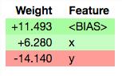

In our case, we will use it to see the correlation of each feature/text with the target variable. We can inspect features and weights because we are using a bag-of-words vectorizer and a linear classifier (so there is a direct mapping between individual words and classifier coefficients). 

### How does Eli5 Work?
It shows us the correlation of each feature/text with the target variable. We can inspect features and weights because we are using a bag-of-words vectorizer and a linear classifier (so there is a direct mapping between individual words and classifier coefficients). 

*source: https://eli5.readthedocs.io/en/latest/overview.html#installation*

<a id = 'analyzingEli5'></a>
## Analyzing item description with Eli5
***
We will use only 10% of data for this purpose


```python
train.shape[0]
```


    1481661


```python
reduced_X_train = train.loc[0:1481661, :]
reduced_y_train = y_train[0:1481661]
```


```python
# Definte RMSLE Cross Validation Function
def rmsle_cv(model):
    kf = KFold(shuffle=True, random_state=42).get_n_splits(reduced_X_train['item_description'])
    rmse= np.sqrt(-cross_val_score(model, reduced_X_train['item_description'], reduced_y_train, scoring="neg_mean_squared_error", cv = kf))
    return(rmse.mean())
```

<a id = 'eli5Count'></a>
## Baseline Model with CountVectorizer
***


```python
vec = CountVectorizer()
clf = Ridge(random_state=42)
pipe = make_pipeline(vec, clf)
pipe.fit(reduced_X_train['item_description'], reduced_y_train)

cv_rmsle = rmsle_cv(pipe)

print("The Validation Score is: " + str(cv_rmsle))
```

    The Validation Score is: 0.6259487648048925


```python
import eli5
eli5.show_weights(pipe, vec=vec, top=100, feature_filter=lambda x: x != '<BIAS>')
```


    <style>
    table.eli5-weights tr:hover {
        filter: brightness(85%);
    }
</style>


    

    

    

    

    

    


    

    

    

    
        

    

        
            
                
                
    
        <p style="margin-bottom: 0.5em; margin-top: 0em">
            <b>
    
        y
    
</b>

top features
        </p>
    
    <table class="eli5-weights"
           style="border-collapse: collapse; border: none; margin-top: 0em; table-layout: auto; margin-bottom: 2em;">
        <thead>
        <tr style="border: none;">
            
                <th style="padding: 0 1em 0 0.5em; text-align: right; border: none;" title="Feature weights. Note that weights do not account for feature value scales, so if feature values have different scales, features with highest weights might not be the most important.">
                    Weight<sup>?</sup>
                </th>
            
            <th style="padding: 0 0.5em 0 0.5em; text-align: left; border: none;">Feature</th>
            
        </tr>
        </thead>
        <tbody>
        
            <tr style="background-color: hsl(120, 100.00%, 81.67%); border: none;">
    <td style="padding: 0 1em 0 0.5em; text-align: right; border: none;">
        +1.468
    </td>
    <td style="padding: 0 0.5em 0 0.5em; text-align: left; border: none;">
        substitut
    </td>
    
</tr>
        
            <tr style="background-color: hsl(120, 100.00%, 83.72%); border: none;">
    <td style="padding: 0 1em 0 0.5em; text-align: right; border: none;">
        +1.239
    </td>
    <td style="padding: 0 0.5em 0 0.5em; text-align: left; border: none;">
        hatchim
    </td>
    
</tr>
        
            <tr style="background-color: hsl(120, 100.00%, 85.65%); border: none;">
    <td style="padding: 0 1em 0 0.5em; text-align: right; border: none;">
        +1.035
    </td>
    <td style="padding: 0 0.5em 0 0.5em; text-align: left; border: none;">
        visa
    </td>
    
</tr>
        
            <tr style="background-color: hsl(120, 100.00%, 85.65%); border: none;">
    <td style="padding: 0 1em 0 0.5em; text-align: right; border: none;">
        +1.035
    </td>
    <td style="padding: 0 0.5em 0 0.5em; text-align: left; border: none;">
        dockatot
    </td>
    
</tr>
        
            <tr style="background-color: hsl(120, 100.00%, 85.80%); border: none;">
    <td style="padding: 0 1em 0 0.5em; text-align: right; border: none;">
        +1.020
    </td>
    <td style="padding: 0 0.5em 0 0.5em; text-align: left; border: none;">
        louboutins
    </td>
    
</tr>
        
            <tr style="background-color: hsl(120, 100.00%, 85.80%); border: none;">
    <td style="padding: 0 1em 0 0.5em; text-align: right; border: none;">
        +1.019
    </td>
    <td style="padding: 0 0.5em 0 0.5em; text-align: left; border: none;">
        neverful
    </td>
    
</tr>
        
            <tr style="background-color: hsl(120, 100.00%, 85.86%); border: none;">
    <td style="padding: 0 1em 0 0.5em; text-align: right; border: none;">
        +1.013
    </td>
    <td style="padding: 0 0.5em 0 0.5em; text-align: left; border: none;">
        vnd
    </td>
    
</tr>
        
            <tr style="background-color: hsl(120, 100.00%, 85.88%); border: none;">
    <td style="padding: 0 1em 0 0.5em; text-align: right; border: none;">
        +1.011
    </td>
    <td style="padding: 0 0.5em 0 0.5em; text-align: left; border: none;">
        xperia
    </td>
    
</tr>
        
            <tr style="background-color: hsl(120, 100.00%, 86.12%); border: none;">
    <td style="padding: 0 1em 0 0.5em; text-align: right; border: none;">
        +0.986
    </td>
    <td style="padding: 0 0.5em 0 0.5em; text-align: left; border: none;">
        nmds
    </td>
    
</tr>
        
            <tr style="background-color: hsl(120, 100.00%, 86.17%); border: none;">
    <td style="padding: 0 1em 0 0.5em; text-align: right; border: none;">
        +0.981
    </td>
    <td style="padding: 0 0.5em 0 0.5em; text-align: left; border: none;">
        accucheck
    </td>
    
</tr>
        
            <tr style="background-color: hsl(120, 100.00%, 86.20%); border: none;">
    <td style="padding: 0 1em 0 0.5em; text-align: right; border: none;">
        +0.979
    </td>
    <td style="padding: 0 0.5em 0 0.5em; text-align: left; border: none;">
        deadstock
    </td>
    
</tr>
        
            <tr style="background-color: hsl(120, 100.00%, 86.26%); border: none;">
    <td style="padding: 0 1em 0 0.5em; text-align: right; border: none;">
        +0.972
    </td>
    <td style="padding: 0 0.5em 0 0.5em; text-align: left; border: none;">
        wheaton
    </td>
    
</tr>
        
            <tr style="background-color: hsl(120, 100.00%, 86.31%); border: none;">
    <td style="padding: 0 1em 0 0.5em; text-align: right; border: none;">
        +0.968
    </td>
    <td style="padding: 0 0.5em 0 0.5em; text-align: left; border: none;">
        vnds
    </td>
    
</tr>
        
            <tr style="background-color: hsl(120, 100.00%, 86.88%); border: none;">
    <td style="padding: 0 1em 0 0.5em; text-align: right; border: none;">
        +0.911
    </td>
    <td style="padding: 0 0.5em 0 0.5em; text-align: left; border: none;">
        appraisal
    </td>
    
</tr>
        
            <tr style="background-color: hsl(120, 100.00%, 86.98%); border: none;">
    <td style="padding: 0 1em 0 0.5em; text-align: right; border: none;">
        +0.900
    </td>
    <td style="padding: 0 0.5em 0 0.5em; text-align: left; border: none;">
        harlie
    </td>
    
</tr>
        
            <tr style="background-color: hsl(120, 100.00%, 87.39%); border: none;">
    <td style="padding: 0 1em 0 0.5em; text-align: right; border: none;">
        +0.860
    </td>
    <td style="padding: 0 0.5em 0 0.5em; text-align: left; border: none;">
        rmauthentic
    </td>
    
</tr>
        
            <tr style="background-color: hsl(120, 100.00%, 87.44%); border: none;">
    <td style="padding: 0 1em 0 0.5em; text-align: right; border: none;">
        +0.856
    </td>
    <td style="padding: 0 0.5em 0 0.5em; text-align: left; border: none;">
        tieks
    </td>
    
</tr>
        
            <tr style="background-color: hsl(120, 100.00%, 87.45%); border: none;">
    <td style="padding: 0 1em 0 0.5em; text-align: right; border: none;">
        +0.854
    </td>
    <td style="padding: 0 0.5em 0 0.5em; text-align: left; border: none;">
        tria
    </td>
    
</tr>
        
            <tr style="background-color: hsl(120, 100.00%, 87.61%); border: none;">
    <td style="padding: 0 1em 0 0.5em; text-align: right; border: none;">
        +0.839
    </td>
    <td style="padding: 0 0.5em 0 0.5em; text-align: left; border: none;">
        obagi
    </td>
    
</tr>
        
            <tr style="background-color: hsl(120, 100.00%, 87.63%); border: none;">
    <td style="padding: 0 1em 0 0.5em; text-align: right; border: none;">
        +0.837
    </td>
    <td style="padding: 0 0.5em 0 0.5em; text-align: left; border: none;">
        boxdust
    </td>
    
</tr>
        
            <tr style="background-color: hsl(120, 100.00%, 87.78%); border: none;">
    <td style="padding: 0 1em 0 0.5em; text-align: right; border: none;">
        +0.822
    </td>
    <td style="padding: 0 0.5em 0 0.5em; text-align: left; border: none;">
        snesnintendo
    </td>
    
</tr>
        
            <tr style="background-color: hsl(120, 100.00%, 87.88%); border: none;">
    <td style="padding: 0 1em 0 0.5em; text-align: right; border: none;">
        +0.813
    </td>
    <td style="padding: 0 0.5em 0 0.5em; text-align: left; border: none;">
        hatchimal
    </td>
    
</tr>
        
            <tr style="background-color: hsl(120, 100.00%, 87.97%); border: none;">
    <td style="padding: 0 1em 0 0.5em; text-align: right; border: none;">
        +0.805
    </td>
    <td style="padding: 0 0.5em 0 0.5em; text-align: left; border: none;">
        scren
    </td>
    
</tr>
        
            <tr style="background-color: hsl(120, 100.00%, 88.07%); border: none;">
    <td style="padding: 0 1em 0 0.5em; text-align: right; border: none;">
        +0.794
    </td>
    <td style="padding: 0 0.5em 0 0.5em; text-align: left; border: none;">
        lambskin
    </td>
    
</tr>
        
            <tr style="background-color: hsl(120, 100.00%, 88.19%); border: none;">
    <td style="padding: 0 1em 0 0.5em; text-align: right; border: none;">
        +0.783
    </td>
    <td style="padding: 0 0.5em 0 0.5em; text-align: left; border: none;">
        galss
    </td>
    
</tr>
        
            <tr style="background-color: hsl(120, 100.00%, 88.21%); border: none;">
    <td style="padding: 0 1em 0 0.5em; text-align: right; border: none;">
        +0.782
    </td>
    <td style="padding: 0 0.5em 0 0.5em; text-align: left; border: none;">
        draggl
    </td>
    
</tr>
        
            <tr style="background-color: hsl(120, 100.00%, 88.28%); border: none;">
    <td style="padding: 0 1em 0 0.5em; text-align: right; border: none;">
        +0.775
    </td>
    <td style="padding: 0 0.5em 0 0.5em; text-align: left; border: none;">
        tmobil
    </td>
    
</tr>
        
            <tr style="background-color: hsl(120, 100.00%, 88.29%); border: none;">
    <td style="padding: 0 1em 0 0.5em; text-align: right; border: none;">
        +0.774
    </td>
    <td style="padding: 0 0.5em 0 0.5em; text-align: left; border: none;">
        owlet
    </td>
    
</tr>
        
            <tr style="background-color: hsl(120, 100.00%, 88.40%); border: none;">
    <td style="padding: 0 1em 0 0.5em; text-align: right; border: none;">
        +0.763
    </td>
    <td style="padding: 0 0.5em 0 0.5em; text-align: left; border: none;">
        elgato
    </td>
    
</tr>
        
            <tr style="background-color: hsl(120, 100.00%, 88.42%); border: none;">
    <td style="padding: 0 1em 0 0.5em; text-align: right; border: none;">
        +0.762
    </td>
    <td style="padding: 0 0.5em 0 0.5em; text-align: left; border: none;">
        owlicorn
    </td>
    
</tr>
        
            <tr style="background-color: hsl(120, 100.00%, 88.44%); border: none;">
    <td style="padding: 0 1em 0 0.5em; text-align: right; border: none;">
        +0.760
    </td>
    <td style="padding: 0 0.5em 0 0.5em; text-align: left; border: none;">
        mumu
    </td>
    
</tr>
        
            <tr style="background-color: hsl(120, 100.00%, 88.50%); border: none;">
    <td style="padding: 0 1em 0 0.5em; text-align: right; border: none;">
        +0.754
    </td>
    <td style="padding: 0 0.5em 0 0.5em; text-align: left; border: none;">
        limbs
    </td>
    
</tr>
        
            <tr style="background-color: hsl(120, 100.00%, 88.55%); border: none;">
    <td style="padding: 0 1em 0 0.5em; text-align: right; border: none;">
        +0.750
    </td>
    <td style="padding: 0 0.5em 0 0.5em; text-align: left; border: none;">
        junip
    </td>
    
</tr>
        
            <tr style="background-color: hsl(120, 100.00%, 88.61%); border: none;">
    <td style="padding: 0 1em 0 0.5em; text-align: right; border: none;">
        +0.744
    </td>
    <td style="padding: 0 0.5em 0 0.5em; text-align: left; border: none;">
        minkpink
    </td>
    
</tr>
        
            <tr style="background-color: hsl(120, 100.00%, 88.64%); border: none;">
    <td style="padding: 0 1em 0 0.5em; text-align: right; border: none;">
        +0.741
    </td>
    <td style="padding: 0 0.5em 0 0.5em; text-align: left; border: none;">
        snapchat
    </td>
    
</tr>
        
            <tr style="background-color: hsl(120, 100.00%, 88.72%); border: none;">
    <td style="padding: 0 1em 0 0.5em; text-align: right; border: none;">
        +0.734
    </td>
    <td style="padding: 0 0.5em 0 0.5em; text-align: left; border: none;">
        layaway
    </td>
    
</tr>
        
            <tr style="background-color: hsl(120, 100.00%, 88.73%); border: none;">
    <td style="padding: 0 1em 0 0.5em; text-align: right; border: none;">
        +0.733
    </td>
    <td style="padding: 0 0.5em 0 0.5em; text-align: left; border: none;">
        matelassé
    </td>
    
</tr>
        
            <tr style="background-color: hsl(120, 100.00%, 88.77%); border: none;">
    <td style="padding: 0 1em 0 0.5em; text-align: right; border: none;">
        +0.729
    </td>
    <td style="padding: 0 0.5em 0 0.5em; text-align: left; border: none;">
        neva
    </td>
    
</tr>
        
            <tr style="background-color: hsl(120, 100.00%, 88.79%); border: none;">
    <td style="padding: 0 1em 0 0.5em; text-align: right; border: none;">
        +0.727
    </td>
    <td style="padding: 0 0.5em 0 0.5em; text-align: left; border: none;">
        nmdr
    </td>
    
</tr>
        
            <tr style="background-color: hsl(120, 100.00%, 88.88%); border: none;">
    <td style="padding: 0 1em 0 0.5em; text-align: right; border: none;">
        +0.718
    </td>
    <td style="padding: 0 0.5em 0 0.5em; text-align: left; border: none;">
        celin
    </td>
    
</tr>
        
            <tr style="background-color: hsl(120, 100.00%, 88.90%); border: none;">
    <td style="padding: 0 1em 0 0.5em; text-align: right; border: none;">
        +0.717
    </td>
    <td style="padding: 0 0.5em 0 0.5em; text-align: left; border: none;">
        prohibited
    </td>
    
</tr>
        
            <tr style="background-color: hsl(120, 100.00%, 88.90%); border: none;">
    <td style="padding: 0 1em 0 0.5em; text-align: right; border: none;">
        +0.717
    </td>
    <td style="padding: 0 0.5em 0 0.5em; text-align: left; border: none;">
        rundisney
    </td>
    
</tr>
        
            <tr style="background-color: hsl(120, 100.00%, 88.95%); border: none;">
    <td style="padding: 0 1em 0 0.5em; text-align: right; border: none;">
        +0.713
    </td>
    <td style="padding: 0 0.5em 0 0.5em; text-align: left; border: none;">
        minibe
    </td>
    
</tr>
        
            <tr style="background-color: hsl(120, 100.00%, 89.02%); border: none;">
    <td style="padding: 0 1em 0 0.5em; text-align: right; border: none;">
        +0.706
    </td>
    <td style="padding: 0 0.5em 0 0.5em; text-align: left; border: none;">
        generated
    </td>
    
</tr>
        
            <tr style="background-color: hsl(120, 100.00%, 89.13%); border: none;">
    <td style="padding: 0 1em 0 0.5em; text-align: right; border: none;">
        +0.696
    </td>
    <td style="padding: 0 0.5em 0 0.5em; text-align: left; border: none;">
        draggle
    </td>
    
</tr>
        
            <tr style="background-color: hsl(120, 100.00%, 89.16%); border: none;">
    <td style="padding: 0 1em 0 0.5em; text-align: right; border: none;">
        +0.694
    </td>
    <td style="padding: 0 0.5em 0 0.5em; text-align: left; border: none;">
        ripka
    </td>
    
</tr>
        
            <tr style="background-color: hsl(120, 100.00%, 89.22%); border: none;">
    <td style="padding: 0 1em 0 0.5em; text-align: right; border: none;">
        +0.688
    </td>
    <td style="padding: 0 0.5em 0 0.5em; text-align: left; border: none;">
        shep
    </td>
    
</tr>
        
            <tr style="background-color: hsl(120, 100.00%, 89.22%); border: none;">
    <td style="padding: 0 1em 0 0.5em; text-align: right; border: none;">
        +0.687
    </td>
    <td style="padding: 0 0.5em 0 0.5em; text-align: left; border: none;">
        penguala
    </td>
    
</tr>
        
            <tr style="background-color: hsl(120, 100.00%, 89.25%); border: none;">
    <td style="padding: 0 1em 0 0.5em; text-align: right; border: none;">
        +0.685
    </td>
    <td style="padding: 0 0.5em 0 0.5em; text-align: left; border: none;">
        saudi
    </td>
    
</tr>
        
            <tr style="background-color: hsl(120, 100.00%, 89.28%); border: none;">
    <td style="padding: 0 1em 0 0.5em; text-align: right; border: none;">
        +0.682
    </td>
    <td style="padding: 0 0.5em 0 0.5em; text-align: left; border: none;">
        ballerine
    </td>
    
</tr>
        
            <tr style="background-color: hsl(120, 100.00%, 89.29%); border: none;">
    <td style="padding: 0 1em 0 0.5em; text-align: right; border: none;">
        +0.681
    </td>
    <td style="padding: 0 0.5em 0 0.5em; text-align: left; border: none;">
        gimbal
    </td>
    
</tr>
        
            <tr style="background-color: hsl(120, 100.00%, 89.30%); border: none;">
    <td style="padding: 0 1em 0 0.5em; text-align: right; border: none;">
        +0.680
    </td>
    <td style="padding: 0 0.5em 0 0.5em; text-align: left; border: none;">
        anya
    </td>
    
</tr>
        
            <tr style="background-color: hsl(120, 100.00%, 89.33%); border: none;">
    <td style="padding: 0 1em 0 0.5em; text-align: right; border: none;">
        +0.678
    </td>
    <td style="padding: 0 0.5em 0 0.5em; text-align: left; border: none;">
        pipping
    </td>
    
</tr>
        
            <tr style="background-color: hsl(120, 100.00%, 89.33%); border: none;">
    <td style="padding: 0 1em 0 0.5em; text-align: right; border: none;">
        +0.677
    </td>
    <td style="padding: 0 0.5em 0 0.5em; text-align: left; border: none;">
        seawheeze
    </td>
    
</tr>
        
            <tr style="background-color: hsl(120, 100.00%, 89.34%); border: none;">
    <td style="padding: 0 1em 0 0.5em; text-align: right; border: none;">
        +0.677
    </td>
    <td style="padding: 0 0.5em 0 0.5em; text-align: left; border: none;">
        hmu
    </td>
    
</tr>
        
            <tr style="background-color: hsl(120, 100.00%, 89.36%); border: none;">
    <td style="padding: 0 1em 0 0.5em; text-align: right; border: none;">
        +0.674
    </td>
    <td style="padding: 0 0.5em 0 0.5em; text-align: left; border: none;">
        metcon
    </td>
    
</tr>
        
            <tr style="background-color: hsl(120, 100.00%, 89.40%); border: none;">
    <td style="padding: 0 1em 0 0.5em; text-align: right; border: none;">
        +0.671
    </td>
    <td style="padding: 0 0.5em 0 0.5em; text-align: left; border: none;">
        coaguchek
    </td>
    
</tr>
        
            <tr style="background-color: hsl(120, 100.00%, 89.40%); border: none;">
    <td style="padding: 0 1em 0 0.5em; text-align: right; border: none;">
        +0.671
    </td>
    <td style="padding: 0 0.5em 0 0.5em; text-align: left; border: none;">
        adidascom
    </td>
    
</tr>
        
            <tr style="background-color: hsl(120, 100.00%, 89.46%); border: none;">
    <td style="padding: 0 1em 0 0.5em; text-align: right; border: none;">
        +0.666
    </td>
    <td style="padding: 0 0.5em 0 0.5em; text-align: left; border: none;">
        vspinkforsale
    </td>
    
</tr>
        
        
            <tr style="background-color: hsl(120, 100.00%, 89.46%); border: none;">
                <td colspan="2" style="padding: 0 0.5em 0 0.5em; text-align: center; border: none; white-space: nowrap;">
                    <i>&hellip; 115419 more positive &hellip;</i>
                </td>
            </tr>
        

        
            <tr style="background-color: hsl(0, 100.00%, 89.51%); border: none;">
                <td colspan="2" style="padding: 0 0.5em 0 0.5em; text-align: center; border: none; white-space: nowrap;">
                    <i>&hellip; 109672 more negative &hellip;</i>
                </td>
            </tr>
        
        
            <tr style="background-color: hsl(0, 100.00%, 89.51%); border: none;">
    <td style="padding: 0 1em 0 0.5em; text-align: right; border: none;">
        -0.662
    </td>
    <td style="padding: 0 0.5em 0 0.5em; text-align: left; border: none;">
        cremieux
    </td>
    
</tr>
        
            <tr style="background-color: hsl(0, 100.00%, 89.49%); border: none;">
    <td style="padding: 0 1em 0 0.5em; text-align: right; border: none;">
        -0.663
    </td>
    <td style="padding: 0 0.5em 0 0.5em; text-align: left; border: none;">
        sariah
    </td>
    
</tr>
        
            <tr style="background-color: hsl(0, 100.00%, 89.49%); border: none;">
    <td style="padding: 0 1em 0 0.5em; text-align: right; border: none;">
        -0.663
    </td>
    <td style="padding: 0 0.5em 0 0.5em; text-align: left; border: none;">
        jkids
    </td>
    
</tr>
        
            <tr style="background-color: hsl(0, 100.00%, 89.46%); border: none;">
    <td style="padding: 0 1em 0 0.5em; text-align: right; border: none;">
        -0.666
    </td>
    <td style="padding: 0 0.5em 0 0.5em; text-align: left; border: none;">
        audiocan
    </td>
    
</tr>
        
            <tr style="background-color: hsl(0, 100.00%, 89.45%); border: none;">
    <td style="padding: 0 1em 0 0.5em; text-align: right; border: none;">
        -0.667
    </td>
    <td style="padding: 0 0.5em 0 0.5em; text-align: left; border: none;">
        crickets
    </td>
    
</tr>
        
            <tr style="background-color: hsl(0, 100.00%, 89.42%); border: none;">
    <td style="padding: 0 1em 0 0.5em; text-align: right; border: none;">
        -0.670
    </td>
    <td style="padding: 0 0.5em 0 0.5em; text-align: left; border: none;">
        lbj
    </td>
    
</tr>
        
            <tr style="background-color: hsl(0, 100.00%, 89.39%); border: none;">
    <td style="padding: 0 1em 0 0.5em; text-align: right; border: none;">
        -0.672
    </td>
    <td style="padding: 0 0.5em 0 0.5em; text-align: left; border: none;">
        isolating
    </td>
    
</tr>
        
            <tr style="background-color: hsl(0, 100.00%, 89.34%); border: none;">
    <td style="padding: 0 1em 0 0.5em; text-align: right; border: none;">
        -0.677
    </td>
    <td style="padding: 0 0.5em 0 0.5em; text-align: left; border: none;">
        laptopcar
    </td>
    
</tr>
        
            <tr style="background-color: hsl(0, 100.00%, 89.28%); border: none;">
    <td style="padding: 0 1em 0 0.5em; text-align: right; border: none;">
        -0.682
    </td>
    <td style="padding: 0 0.5em 0 0.5em; text-align: left; border: none;">
        reuters
    </td>
    
</tr>
        
            <tr style="background-color: hsl(0, 100.00%, 89.24%); border: none;">
    <td style="padding: 0 1em 0 0.5em; text-align: right; border: none;">
        -0.686
    </td>
    <td style="padding: 0 0.5em 0 0.5em; text-align: left; border: none;">
        eyecat
    </td>
    
</tr>
        
            <tr style="background-color: hsl(0, 100.00%, 89.23%); border: none;">
    <td style="padding: 0 1em 0 0.5em; text-align: right; border: none;">
        -0.687
    </td>
    <td style="padding: 0 0.5em 0 0.5em; text-align: left; border: none;">
        evs
    </td>
    
</tr>
        
            <tr style="background-color: hsl(0, 100.00%, 89.21%); border: none;">
    <td style="padding: 0 1em 0 0.5em; text-align: right; border: none;">
        -0.688
    </td>
    <td style="padding: 0 0.5em 0 0.5em; text-align: left; border: none;">
        jamberrys
    </td>
    
</tr>
        
            <tr style="background-color: hsl(0, 100.00%, 89.21%); border: none;">
    <td style="padding: 0 1em 0 0.5em; text-align: right; border: none;">
        -0.689
    </td>
    <td style="padding: 0 0.5em 0 0.5em; text-align: left; border: none;">
        envelop
    </td>
    
</tr>
        
            <tr style="background-color: hsl(0, 100.00%, 89.14%); border: none;">
    <td style="padding: 0 1em 0 0.5em; text-align: right; border: none;">
        -0.695
    </td>
    <td style="padding: 0 0.5em 0 0.5em; text-align: left; border: none;">
        deliv
    </td>
    
</tr>
        
            <tr style="background-color: hsl(0, 100.00%, 89.08%); border: none;">
    <td style="padding: 0 1em 0 0.5em; text-align: right; border: none;">
        -0.700
    </td>
    <td style="padding: 0 0.5em 0 0.5em; text-align: left; border: none;">
        countouring
    </td>
    
</tr>
        
            <tr style="background-color: hsl(0, 100.00%, 89.00%); border: none;">
    <td style="padding: 0 1em 0 0.5em; text-align: right; border: none;">
        -0.708
    </td>
    <td style="padding: 0 0.5em 0 0.5em; text-align: left; border: none;">
        ghostarmor
    </td>
    
</tr>
        
            <tr style="background-color: hsl(0, 100.00%, 88.98%); border: none;">
    <td style="padding: 0 1em 0 0.5em; text-align: right; border: none;">
        -0.709
    </td>
    <td style="padding: 0 0.5em 0 0.5em; text-align: left; border: none;">
        reciev
    </td>
    
</tr>
        
            <tr style="background-color: hsl(0, 100.00%, 88.58%); border: none;">
    <td style="padding: 0 1em 0 0.5em; text-align: right; border: none;">
        -0.747
    </td>
    <td style="padding: 0 0.5em 0 0.5em; text-align: left; border: none;">
        calabash
    </td>
    
</tr>
        
            <tr style="background-color: hsl(0, 100.00%, 88.44%); border: none;">
    <td style="padding: 0 1em 0 0.5em; text-align: right; border: none;">
        -0.760
    </td>
    <td style="padding: 0 0.5em 0 0.5em; text-align: left; border: none;">
        mobiles
    </td>
    
</tr>
        
            <tr style="background-color: hsl(0, 100.00%, 88.39%); border: none;">
    <td style="padding: 0 1em 0 0.5em; text-align: right; border: none;">
        -0.765
    </td>
    <td style="padding: 0 0.5em 0 0.5em; text-align: left; border: none;">
        mondaytuesday
    </td>
    
</tr>
        
            <tr style="background-color: hsl(0, 100.00%, 88.39%); border: none;">
    <td style="padding: 0 1em 0 0.5em; text-align: right; border: none;">
        -0.765
    </td>
    <td style="padding: 0 0.5em 0 0.5em; text-align: left; border: none;">
        ndsi
    </td>
    
</tr>
        
            <tr style="background-color: hsl(0, 100.00%, 87.83%); border: none;">
    <td style="padding: 0 1em 0 0.5em; text-align: right; border: none;">
        -0.818
    </td>
    <td style="padding: 0 0.5em 0 0.5em; text-align: left; border: none;">
        wakami
    </td>
    
</tr>
        
            <tr style="background-color: hsl(0, 100.00%, 87.44%); border: none;">
    <td style="padding: 0 1em 0 0.5em; text-align: right; border: none;">
        -0.855
    </td>
    <td style="padding: 0 0.5em 0 0.5em; text-align: left; border: none;">
        xbmc
    </td>
    
</tr>
        
            <tr style="background-color: hsl(0, 100.00%, 87.01%); border: none;">
    <td style="padding: 0 1em 0 0.5em; text-align: right; border: none;">
        -0.898
    </td>
    <td style="padding: 0 0.5em 0 0.5em; text-align: left; border: none;">
        preme
    </td>
    
</tr>
        
            <tr style="background-color: hsl(0, 100.00%, 86.47%); border: none;">
    <td style="padding: 0 1em 0 0.5em; text-align: right; border: none;">
        -0.951
    </td>
    <td style="padding: 0 0.5em 0 0.5em; text-align: left; border: none;">
        ogs
    </td>
    
</tr>
        
            <tr style="background-color: hsl(0, 100.00%, 86.24%); border: none;">
    <td style="padding: 0 1em 0 0.5em; text-align: right; border: none;">
        -0.975
    </td>
    <td style="padding: 0 0.5em 0 0.5em; text-align: left; border: none;">
        bundleable
    </td>
    
</tr>
        
            <tr style="background-color: hsl(0, 100.00%, 86.22%); border: none;">
    <td style="padding: 0 1em 0 0.5em; text-align: right; border: none;">
        -0.977
    </td>
    <td style="padding: 0 0.5em 0 0.5em; text-align: left; border: none;">
        communicates
    </td>
    
</tr>
        
            <tr style="background-color: hsl(0, 100.00%, 86.03%); border: none;">
    <td style="padding: 0 1em 0 0.5em; text-align: right; border: none;">
        -0.996
    </td>
    <td style="padding: 0 0.5em 0 0.5em; text-align: left; border: none;">
        popclick
    </td>
    
</tr>
        
            <tr style="background-color: hsl(0, 100.00%, 85.98%); border: none;">
    <td style="padding: 0 1em 0 0.5em; text-align: right; border: none;">
        -1.001
    </td>
    <td style="padding: 0 0.5em 0 0.5em; text-align: left; border: none;">
        qualitynew
    </td>
    
</tr>
        
            <tr style="background-color: hsl(0, 100.00%, 85.92%); border: none;">
    <td style="padding: 0 1em 0 0.5em; text-align: right; border: none;">
        -1.007
    </td>
    <td style="padding: 0 0.5em 0 0.5em; text-align: left; border: none;">
        shippingalways
    </td>
    
</tr>
        
            <tr style="background-color: hsl(0, 100.00%, 85.79%); border: none;">
    <td style="padding: 0 1em 0 0.5em; text-align: right; border: none;">
        -1.020
    </td>
    <td style="padding: 0 0.5em 0 0.5em; text-align: left; border: none;">
        grails
    </td>
    
</tr>
        
            <tr style="background-color: hsl(0, 100.00%, 85.61%); border: none;">
    <td style="padding: 0 1em 0 0.5em; text-align: right; border: none;">
        -1.039
    </td>
    <td style="padding: 0 0.5em 0 0.5em; text-align: left; border: none;">
        vlpnm
    </td>
    
</tr>
        
            <tr style="background-color: hsl(0, 100.00%, 85.10%); border: none;">
    <td style="padding: 0 1em 0 0.5em; text-align: right; border: none;">
        -1.092
    </td>
    <td style="padding: 0 0.5em 0 0.5em; text-align: left; border: none;">
        servicehonest
    </td>
    
</tr>
        
            <tr style="background-color: hsl(0, 100.00%, 85.08%); border: none;">
    <td style="padding: 0 1em 0 0.5em; text-align: right; border: none;">
        -1.093
    </td>
    <td style="padding: 0 0.5em 0 0.5em; text-align: left; border: none;">
        bagspurses
    </td>
    
</tr>
        
            <tr style="background-color: hsl(0, 100.00%, 83.97%); border: none;">
    <td style="padding: 0 1em 0 0.5em; text-align: right; border: none;">
        -1.212
    </td>
    <td style="padding: 0 0.5em 0 0.5em; text-align: left; border: none;">
        ndrd
    </td>
    
</tr>
        
            <tr style="background-color: hsl(0, 100.00%, 83.82%); border: none;">
    <td style="padding: 0 1em 0 0.5em; text-align: right; border: none;">
        -1.229
    </td>
    <td style="padding: 0 0.5em 0 0.5em; text-align: left; border: none;">
        rabito
    </td>
    
</tr>
        
            <tr style="background-color: hsl(0, 100.00%, 83.82%); border: none;">
    <td style="padding: 0 1em 0 0.5em; text-align: right; border: none;">
        -1.229
    </td>
    <td style="padding: 0 0.5em 0 0.5em; text-align: left; border: none;">
        rilakkumma
    </td>
    
</tr>
        
            <tr style="background-color: hsl(0, 100.00%, 83.48%); border: none;">
    <td style="padding: 0 1em 0 0.5em; text-align: right; border: none;">
        -1.265
    </td>
    <td style="padding: 0 0.5em 0 0.5em; text-align: left; border: none;">
        suppy
    </td>
    
</tr>
        
            <tr style="background-color: hsl(0, 100.00%, 82.00%); border: none;">
    <td style="padding: 0 1em 0 0.5em; text-align: right; border: none;">
        -1.431
    </td>
    <td style="padding: 0 0.5em 0 0.5em; text-align: left; border: none;">
        besso
    </td>
    
</tr>
        
            <tr style="background-color: hsl(0, 100.00%, 81.64%); border: none;">
    <td style="padding: 0 1em 0 0.5em; text-align: right; border: none;">
        -1.471
    </td>
    <td style="padding: 0 0.5em 0 0.5em; text-align: left; border: none;">
        gbipod
    </td>
    
</tr>
        
            <tr style="background-color: hsl(0, 100.00%, 80.00%); border: none;">
    <td style="padding: 0 1em 0 0.5em; text-align: right; border: none;">
        -1.663
    </td>
    <td style="padding: 0 0.5em 0 0.5em; text-align: left; border: none;">
        iphonessipad
    </td>
    
</tr>
        

        </tbody>
    </table>

            
        

        


    

    

    

    


    

    

    

    

    

    


    

    

    

    

    

    


```python
eli5.show_prediction(clf, doc=reduced_X_train['item_description'][1297], vec=vec)
```


    <style>
    table.eli5-weights tr:hover {
        filter: brightness(85%);
    }
</style>


    

    

    

    

    

    


    

    

    

    
        

    

        

        
    
        
        
    
        <p style="margin-bottom: 0.5em; margin-top: 0em">
            <b>
    
        y
    
</b>

    
    (score <b>2.574</b>)

top features
        </p>
    
    <table class="eli5-weights"
           style="border-collapse: collapse; border: none; margin-top: 0em; table-layout: auto; margin-bottom: 2em;">
        <thead>
        <tr style="border: none;">
            
                <th style="padding: 0 1em 0 0.5em; text-align: right; border: none;" title="Feature contribution already accounts for the feature value (for linear models, contribution = weight * feature value), and the sum of feature contributions is equal to the score or, for some classifiers, to the probability. Feature values are shown if &quot;show_feature_values&quot; is True.">
                    Contribution<sup>?</sup>
                </th>
            
            <th style="padding: 0 0.5em 0 0.5em; text-align: left; border: none;">Feature</th>
            
        </tr>
        </thead>
        <tbody>
        
            <tr style="background-color: hsl(120, 100.00%, 80.00%); border: none;">
    <td style="padding: 0 1em 0 0.5em; text-align: right; border: none;">
        +2.828
    </td>
    <td style="padding: 0 0.5em 0 0.5em; text-align: left; border: none;">
        &lt;BIAS&gt;
    </td>
    
</tr>
        
        

        
        
            <tr style="background-color: hsl(0, 100.00%, 96.30%); border: none;">
    <td style="padding: 0 1em 0 0.5em; text-align: right; border: none;">
        -0.254
    </td>
    <td style="padding: 0 0.5em 0 0.5em; text-align: left; border: none;">
        Highlighted in text (sum)
    </td>
    
</tr>
        

        </tbody>
    </table>

    


    <p style="margin-bottom: 2.5em; margin-top:-0.5em;">
        <span style="background-color: hsl(0, 100.00%, 78.67%); opacity: 0.88" title="-0.058">fits</span><span style="opacity: 0.80"> </span><span style="background-color: hsl(0, 100.00%, 60.00%); opacity: 1.00" title="-0.143">android</span><span style="opacity: 0.80"> </span><span style="background-color: hsl(0, 100.00%, 83.66%); opacity: 0.86" title="-0.040">galaxy</span><span style="opacity: 0.80"> </span><span style="background-color: hsl(0, 100.00%, 87.15%); opacity: 0.84" title="-0.028">phone</span><span style="opacity: 0.80"> </span><span style="background-color: hsl(0, 100.00%, 85.20%); opacity: 0.85" title="-0.035">ones</span><span style="opacity: 0.80"> </span><span style="background-color: hsl(0, 100.00%, 70.06%); opacity: 0.93" title="-0.095">compatible</span><span style="opacity: 0.80"> </span><span style="background-color: hsl(120, 100.00%, 80.68%); opacity: 0.87" title="0.051">works</span><span style="opacity: 0.80"> </span><span style="background-color: hsl(120, 100.00%, 69.83%); opacity: 0.93" title="0.096">perfectly</span><span style="opacity: 0.80">  </span><span style="background-color: hsl(120, 100.00%, 97.13%); opacity: 0.80" title="0.003">foot</span><span style="opacity: 0.80"> </span><span style="background-color: hsl(0, 100.00%, 96.57%); opacity: 0.81" title="-0.004">long</span>
    </p>


    

    

    

    


    

    

    

    

    

    


    

    

    

    

    

    


<a id = 'eli5CountStop'></a>
## Baseline Model with CountVectorizer and Stop Words
***


```python
vec = CountVectorizer(stop_words='english')
clf = Ridge(random_state=42)
pipe = make_pipeline(vec, clf)
pipe.fit(reduced_X_train['item_description'], reduced_y_train)

cv_sw_rmsle = rmsle_cv(pipe)

print("The Validation Score is: " + str(cv_sw_rmsle))
```

    The Validation Score is: 0.6266686967678374


```python
eli5.show_prediction(clf, doc=reduced_X_train['item_description'][1297], vec=vec)
```


    <style>
    table.eli5-weights tr:hover {
        filter: brightness(85%);
    }
</style>


    

    

    

    

    

    


    

    

    

    
        

    

        

        
    
        
        
    
        <p style="margin-bottom: 0.5em; margin-top: 0em">
            <b>
    
        y
    
</b>

    
    (score <b>2.578</b>)

top features
        </p>
    
    <table class="eli5-weights"
           style="border-collapse: collapse; border: none; margin-top: 0em; table-layout: auto; margin-bottom: 2em;">
        <thead>
        <tr style="border: none;">
            
                <th style="padding: 0 1em 0 0.5em; text-align: right; border: none;" title="Feature contribution already accounts for the feature value (for linear models, contribution = weight * feature value), and the sum of feature contributions is equal to the score or, for some classifiers, to the probability. Feature values are shown if &quot;show_feature_values&quot; is True.">
                    Contribution<sup>?</sup>
                </th>
            
            <th style="padding: 0 0.5em 0 0.5em; text-align: left; border: none;">Feature</th>
            
        </tr>
        </thead>
        <tbody>
        
            <tr style="background-color: hsl(120, 100.00%, 80.00%); border: none;">
    <td style="padding: 0 1em 0 0.5em; text-align: right; border: none;">
        +2.828
    </td>
    <td style="padding: 0 0.5em 0 0.5em; text-align: left; border: none;">
        &lt;BIAS&gt;
    </td>
    
</tr>
        
        

        
        
            <tr style="background-color: hsl(0, 100.00%, 96.33%); border: none;">
    <td style="padding: 0 1em 0 0.5em; text-align: right; border: none;">
        -0.251
    </td>
    <td style="padding: 0 0.5em 0 0.5em; text-align: left; border: none;">
        Highlighted in text (sum)
    </td>
    
</tr>
        

        </tbody>
    </table>

    


    <p style="margin-bottom: 2.5em; margin-top:-0.5em;">
        <span style="background-color: hsl(0, 100.00%, 78.68%); opacity: 0.88" title="-0.059">fits</span><span style="opacity: 0.80"> </span><span style="background-color: hsl(0, 100.00%, 60.00%); opacity: 1.00" title="-0.144">android</span><span style="opacity: 0.80"> </span><span style="background-color: hsl(0, 100.00%, 83.90%); opacity: 0.85" title="-0.039">galaxy</span><span style="opacity: 0.80"> </span><span style="background-color: hsl(0, 100.00%, 87.25%); opacity: 0.84" title="-0.028">phone</span><span style="opacity: 0.80"> </span><span style="background-color: hsl(0, 100.00%, 85.39%); opacity: 0.85" title="-0.034">ones</span><span style="opacity: 0.80"> </span><span style="background-color: hsl(0, 100.00%, 69.80%); opacity: 0.93" title="-0.097">compatible</span><span style="opacity: 0.80"> </span><span style="background-color: hsl(120, 100.00%, 78.81%); opacity: 0.88" title="0.058">works</span><span style="opacity: 0.80"> </span><span style="background-color: hsl(120, 100.00%, 69.74%); opacity: 0.93" title="0.097">perfectly</span><span style="opacity: 0.80">  </span><span style="background-color: hsl(120, 100.00%, 98.72%); opacity: 0.80" title="0.001">foot</span><span style="opacity: 0.80"> </span><span style="background-color: hsl(0, 100.00%, 96.12%); opacity: 0.81" title="-0.005">long</span>
    </p>


    

    

    

    


    

    

    

    

    

    


    

    

    

    

    

    


<a id = 'eli5Tfidf'></a>
## Baseline Model with TF-IDF
***


```python
vec = TfidfVectorizer()
clf = Ridge(random_state=42)
pipe = make_pipeline(vec, clf)
pipe.fit(reduced_X_train['item_description'], reduced_y_train)

tfidf_rmsle = rmsle_cv(pipe)

print("The Validation Score is: " + str(tfidf_rmsle))
```

    The Validation Score is: 0.599742750402696


```python
eli5.show_prediction(clf, doc=reduced_X_train['item_description'][1297], vec=vec)
```


    <style>
    table.eli5-weights tr:hover {
        filter: brightness(85%);
    }
</style>


    

    

    

    

    

    


    

    

    

    
        

    

        

        
    
        
        
    
        <p style="margin-bottom: 0.5em; margin-top: 0em">
            <b>
    
        y
    
</b>

    
    (score <b>2.409</b>)

top features
        </p>
    
    <table class="eli5-weights"
           style="border-collapse: collapse; border: none; margin-top: 0em; table-layout: auto; margin-bottom: 2em;">
        <thead>
        <tr style="border: none;">
            
                <th style="padding: 0 1em 0 0.5em; text-align: right; border: none;" title="Feature contribution already accounts for the feature value (for linear models, contribution = weight * feature value), and the sum of feature contributions is equal to the score or, for some classifiers, to the probability. Feature values are shown if &quot;show_feature_values&quot; is True.">
                    Contribution<sup>?</sup>
                </th>
            
            <th style="padding: 0 0.5em 0 0.5em; text-align: left; border: none;">Feature</th>
            
        </tr>
        </thead>
        <tbody>
        
            <tr style="background-color: hsl(120, 100.00%, 80.00%); border: none;">
    <td style="padding: 0 1em 0 0.5em; text-align: right; border: none;">
        +2.700
    </td>
    <td style="padding: 0 0.5em 0 0.5em; text-align: left; border: none;">
        &lt;BIAS&gt;
    </td>
    
</tr>
        
        

        
        
            <tr style="background-color: hsl(0, 100.00%, 95.79%); border: none;">
    <td style="padding: 0 1em 0 0.5em; text-align: right; border: none;">
        -0.291
    </td>
    <td style="padding: 0 0.5em 0 0.5em; text-align: left; border: none;">
        Highlighted in text (sum)
    </td>
    
</tr>
        

        </tbody>
    </table>

    


    <p style="margin-bottom: 2.5em; margin-top:-0.5em;">
        <span style="background-color: hsl(0, 100.00%, 86.79%); opacity: 0.84" title="-0.037">fits</span><span style="opacity: 0.80"> </span><span style="background-color: hsl(0, 100.00%, 62.60%); opacity: 0.98" title="-0.164">android</span><span style="opacity: 0.80"> </span><span style="background-color: hsl(0, 100.00%, 75.41%); opacity: 0.90" title="-0.090">galaxy</span><span style="opacity: 0.80"> </span><span style="background-color: hsl(0, 100.00%, 90.54%); opacity: 0.83" title="-0.023">phone</span><span style="opacity: 0.80"> </span><span style="background-color: hsl(0, 100.00%, 91.37%); opacity: 0.82" title="-0.020">ones</span><span style="opacity: 0.80"> </span><span style="background-color: hsl(0, 100.00%, 60.00%); opacity: 1.00" title="-0.181">compatible</span><span style="opacity: 0.80"> </span><span style="background-color: hsl(120, 100.00%, 82.96%); opacity: 0.86" title="0.053">works</span><span style="opacity: 0.80"> </span><span style="background-color: hsl(120, 100.00%, 67.67%); opacity: 0.95" title="0.133">perfectly</span><span style="opacity: 0.80">  </span><span style="background-color: hsl(120, 100.00%, 86.70%); opacity: 0.84" title="0.037">foot</span><span style="opacity: 0.80"> </span><span style="background-color: hsl(0, 100.00%, 99.81%); opacity: 0.80" title="-0.000">long</span>
    </p>


    

    

    

    


    

    

    

    

    

    


    

    

    

    

    

    


<a id = 'eli5TfidfStop'></a>
## Baseline Model with TF-IDF and Stop Words
***


```python
vec = TfidfVectorizer(stop_words='english')
clf = Ridge(random_state=42)
pipe = make_pipeline(vec, clf)
pipe.fit(reduced_X_train['item_description'], reduced_y_train)

tfidf_sw_rmsle = rmsle_cv(pipe)

print("The Validation Score is: " + str(tfidf_sw_rmsle))
```

    The Validation Score is: 0.6011751689044808


```python
eli5.show_prediction(clf, doc=reduced_X_train['item_description'][1297], vec=vec)
```


    <style>
    table.eli5-weights tr:hover {
        filter: brightness(85%);
    }
</style>


    

    

    

    

    

    


    

    

    

    
        

    

        

        
    
        
        
    
        <p style="margin-bottom: 0.5em; margin-top: 0em">
            <b>
    
        y
    
</b>

    
    (score <b>2.431</b>)

top features
        </p>
    
    <table class="eli5-weights"
           style="border-collapse: collapse; border: none; margin-top: 0em; table-layout: auto; margin-bottom: 2em;">
        <thead>
        <tr style="border: none;">
            
                <th style="padding: 0 1em 0 0.5em; text-align: right; border: none;" title="Feature contribution already accounts for the feature value (for linear models, contribution = weight * feature value), and the sum of feature contributions is equal to the score or, for some classifiers, to the probability. Feature values are shown if &quot;show_feature_values&quot; is True.">
                    Contribution<sup>?</sup>
                </th>
            
            <th style="padding: 0 0.5em 0 0.5em; text-align: left; border: none;">Feature</th>
            
        </tr>
        </thead>
        <tbody>
        
            <tr style="background-color: hsl(120, 100.00%, 80.00%); border: none;">
    <td style="padding: 0 1em 0 0.5em; text-align: right; border: none;">
        +2.763
    </td>
    <td style="padding: 0 0.5em 0 0.5em; text-align: left; border: none;">
        &lt;BIAS&gt;
    </td>
    
</tr>
        
        

        
        
            <tr style="background-color: hsl(0, 100.00%, 95.47%); border: none;">
    <td style="padding: 0 1em 0 0.5em; text-align: right; border: none;">
        -0.331
    </td>
    <td style="padding: 0 0.5em 0 0.5em; text-align: left; border: none;">
        Highlighted in text (sum)
    </td>
    
</tr>
        

        </tbody>
    </table>

    


    <p style="margin-bottom: 2.5em; margin-top:-0.5em;">
        <span style="background-color: hsl(0, 100.00%, 86.37%); opacity: 0.84" title="-0.041">fits</span><span style="opacity: 0.80"> </span><span style="background-color: hsl(0, 100.00%, 63.28%); opacity: 0.98" title="-0.167">android</span><span style="opacity: 0.80"> </span><span style="background-color: hsl(0, 100.00%, 74.82%); opacity: 0.90" title="-0.097">galaxy</span><span style="opacity: 0.80"> </span><span style="background-color: hsl(0, 100.00%, 90.40%); opacity: 0.83" title="-0.025">phone</span><span style="opacity: 0.80"> </span><span style="background-color: hsl(0, 100.00%, 91.86%); opacity: 0.82" title="-0.019">ones</span><span style="opacity: 0.80"> </span><span style="background-color: hsl(0, 100.00%, 60.00%); opacity: 1.00" title="-0.189">compatible</span><span style="opacity: 0.80"> </span><span style="background-color: hsl(120, 100.00%, 84.12%); opacity: 0.85" title="0.050">works</span><span style="opacity: 0.80"> </span><span style="background-color: hsl(120, 100.00%, 69.24%); opacity: 0.94" title="0.130">perfectly</span><span style="opacity: 0.80">  </span><span style="background-color: hsl(120, 100.00%, 88.32%); opacity: 0.83" title="0.033">foot</span><span style="opacity: 0.80"> </span><span style="background-color: hsl(0, 100.00%, 96.34%); opacity: 0.81" title="-0.006">long</span>
    </p>


    

    

    

    


    

    

    

    

    

    


    

    

    

    

    

    


<a id = 'eli5TfidfNgrams'></a>
## Baseline Model with TF-IDF, Stop Words and N-Grams
***


```python
vec = TfidfVectorizer(stop_words='english', ngram_range=(1,2))
clf = Ridge(random_state=42)
pipe = make_pipeline(vec, clf)
pipe.fit(reduced_X_train['item_description'], reduced_y_train)

tfidf_sw_ng_rmsle = rmsle_cv(pipe)

print("The Validation Score is: " + str(tfidf_sw_ng_rmsle))
```

    The Validation Score is: 0.5707428237325486


```python
eli5.show_prediction(clf, doc=reduced_X_train['item_description'][1297], vec=vec)
```


    <style>
    table.eli5-weights tr:hover {
        filter: brightness(85%);
    }
</style>


    

    

    

    

    

    


    

    

    

    
        

    

        

        
    
        
        
    
        <p style="margin-bottom: 0.5em; margin-top: 0em">
            <b>
    
        y
    
</b>

    
    (score <b>2.297</b>)

top features
        </p>
    
    <table class="eli5-weights"
           style="border-collapse: collapse; border: none; margin-top: 0em; table-layout: auto; margin-bottom: 2em;">
        <thead>
        <tr style="border: none;">
            
                <th style="padding: 0 1em 0 0.5em; text-align: right; border: none;" title="Feature contribution already accounts for the feature value (for linear models, contribution = weight * feature value), and the sum of feature contributions is equal to the score or, for some classifiers, to the probability. Feature values are shown if &quot;show_feature_values&quot; is True.">
                    Contribution<sup>?</sup>
                </th>
            
            <th style="padding: 0 0.5em 0 0.5em; text-align: left; border: none;">Feature</th>
            
        </tr>
        </thead>
        <tbody>
        
            <tr style="background-color: hsl(120, 100.00%, 80.00%); border: none;">
    <td style="padding: 0 1em 0 0.5em; text-align: right; border: none;">
        +2.780
    </td>
    <td style="padding: 0 0.5em 0 0.5em; text-align: left; border: none;">
        &lt;BIAS&gt;
    </td>
    
</tr>
        
        

        
        
            <tr style="background-color: hsl(0, 100.00%, 94.13%); border: none;">
    <td style="padding: 0 1em 0 0.5em; text-align: right; border: none;">
        -0.483
    </td>
    <td style="padding: 0 0.5em 0 0.5em; text-align: left; border: none;">
        Highlighted in text (sum)
    </td>
    
</tr>
        

        </tbody>
    </table>

    


    <p style="margin-bottom: 2.5em; margin-top:-0.5em;">
        <span style="background-color: hsl(0, 100.00%, 89.74%); opacity: 0.83" title="-0.029">fits</span><span style="opacity: 0.80"> </span><span style="background-color: hsl(0, 100.00%, 71.28%); opacity: 0.92" title="-0.124">android</span><span style="opacity: 0.80"> </span><span style="background-color: hsl(0, 100.00%, 60.00%); opacity: 1.00" title="-0.200">galaxy</span><span style="opacity: 0.80"> </span><span style="background-color: hsl(0, 100.00%, 67.29%); opacity: 0.95" title="-0.150">phone</span><span style="opacity: 0.80"> </span><span style="background-color: hsl(0, 100.00%, 75.15%); opacity: 0.90" title="-0.101">ones</span><span style="opacity: 0.80"> </span><span style="background-color: hsl(0, 100.00%, 69.96%); opacity: 0.93" title="-0.133">compatible</span><span style="opacity: 0.80"> </span><span style="background-color: hsl(120, 100.00%, 68.23%); opacity: 0.94" title="0.144">works</span><span style="opacity: 0.80"> </span><span style="background-color: hsl(120, 100.00%, 77.65%); opacity: 0.89" title="0.087">perfectly</span><span style="opacity: 0.80">  </span><span style="background-color: hsl(0, 100.00%, 72.54%); opacity: 0.92" title="-0.117">foot</span><span style="opacity: 0.80"> </span><span style="background-color: hsl(0, 100.00%, 71.71%); opacity: 0.92" title="-0.122">long</span>
    </p>


    

    

    

    


    

    

    

    

    

    


    

    

    

    

    

    


<a id = 'eli5Rmsle'></a>
## RMSLE Summary
***
TF-IDF + Stop Words + N-Grams works best


```python
print ("RMSLE Score: " + str(cv_rmsle) + " | CountVectorizer")
print ("RMSLE Score: " + str(cv_sw_rmsle) + " | CountVectorizer | Stop Words")
print ("RMSLE Score: " + str(tfidf_rmsle) + " | TF-IDF")
print ("RMSLE Score: " + str(tfidf_sw_rmsle) + " | TF-IDF | Stop Words")
print ("RMSLE Score: " + str(tfidf_sw_ng_rmsle) + " | TF-IDF | Stop Words | N-Grams")
```

    RMSLE Score: 0.6259487648048925 | CountVectorizer
    RMSLE Score: 0.6266686967678374 | CountVectorizer | Stop Words
    RMSLE Score: 0.599742750402696 | TF-IDF
    RMSLE Score: 0.6011751689044808 | TF-IDF | Stop Words
    RMSLE Score: 0.5707428237325486 | TF-IDF | Stop Words | N-Grams


***

# Encoding
***


```python
# Apply get_dummies to "item_condition_id" and "shipping" and then convert into a CSR Matrix
X_dummies = csr_matrix(pd.get_dummies(all_data[['item_condition_id', 'shipping']], sparse=True).values)
```

# Merge the Sparse Matrices
***


```python
# converting numerical columns to matrix
X_numerical = all_data[['is_branded', 'length', 'unique']].as_matrix()

# Combine everything together
sparse_merge = hstack((X_dummies, X_description, X_name, X_category_main, X_category_sub1, X_category_sub2, X_numerical)).tocsr()
```


```python
sparse_merge.shape
```


    (2175020, 76506)


# Train and Test Split
***


```python
X_train_sparse = sparse_merge[:train_size]

X_test = sparse_merge[train_size:]
```

# Modelling
***

<a id = 'defineRmsle'></a>
## Define RMSLE Function
***


```python
def get_rmsle(y, pred): return np.sqrt(mean_squared_error(y, pred))
```

<a id = 'ridgeCV'></a>
## Ridge Regression Cross Validation
***


```python
%%time

# Create 3-Fold CV
cv = KFold(n_splits=3, shuffle=True, random_state=42)
for train_ids, valid_ids in cv.split(X_train_sparse):
    # Define LGBM Model
    model_ridge = Ridge(solver = "lsqr", fit_intercept=True, random_state=42)
    
    # Fit LGBM Model
    model_ridge.fit(X_train_sparse[train_ids], y_train[train_ids])
    
    # Predict & Evaluate Training Score
    y_pred_train = model_ridge.predict(X_train_sparse[train_ids])
    rmsle_train = get_rmsle(y_pred_train, y_train[train_ids])
    
    # Predict & Evaluate Validation Score
    y_pred_valid = model_ridge.predict(X_train_sparse[valid_ids])
    rmsle_valid = get_rmsle(y_pred_valid, y_train[valid_ids])
    
    print(f'Ridge Training RMSLE: {rmsle_train:.5f}')
    print(f'Ridge Validation RMSLE: {rmsle_valid:.5f}')
```

    Ridge Training RMSLE: 0.55004
    Ridge Validation RMSLE: 0.54978
    Ridge Training RMSLE: 0.54935
    Ridge Validation RMSLE: 0.55065
    Ridge Training RMSLE: 0.54696
    Ridge Validation RMSLE: 0.54841
    CPU times: user 32min 2s, sys: 8.47 s, total: 32min 11s
    Wall time: 32min 18s


<a id = 'lgbmCV'></a>
## LGBM Cross Validation
***
### Why LGBM?
- We need to process huge data. LGBM is a Boosting algorithm that is 'light' (high speed).
- Takes lower memory to run.
- Can handle large size of data.


```python
%%time
import lightgbm as lgb

# Create 3-Fold CV
cv = KFold(n_splits=3, shuffle=True, random_state=42)
for train_ids, valid_ids in cv.split(X_train_sparse):
    # Define LGBM Model
    model_lgb = lgb.LGBMRegressor(num_leaves=31, n_jobs=-1, learning_rate=0.1, n_estimators=500, random_state=42)
    
    # Fit LGBM Model
    model_lgb.fit(X_train_sparse[train_ids], y_train[train_ids])
    
    # Predict & Evaluate Training Score
    y_pred_train = model_lgb.predict(X_train_sparse[train_ids])
    rmsle_train = get_rmsle(y_pred_train, y_train[train_ids])
    
    # Predict & Evaluate Validation Score
    y_pred_valid = model_lgb.predict(X_train_sparse[valid_ids])
    rmsle_valid = get_rmsle(y_pred_valid, y_train[valid_ids])
    
    print(f'LGBM Training RMSLE: {rmsle_train:.5f}')
    print(f'LGBM Validation RMSLE: {rmsle_valid:.5f}')
    
```

    LGBM Training RMSLE: 0.48518
    LGBM Validation RMSLE: 0.48984
    LGBM Training RMSLE: 0.48503
    LGBM Validation RMSLE: 0.49020
    LGBM Training RMSLE: 0.48450
    LGBM Validation RMSLE: 0.49069
    CPU times: user 2h 40min 16s, sys: 1min 28s, total: 2h 41min 44s
    Wall time: 57min 26s


<a id = 'ensemble'></a>
## Ensemble
***
Ensemble modeling is the process of running two or more related but different analytical models and then synthesizing the results into a single score or spread in order to improve the accuracy of predictive analytics.

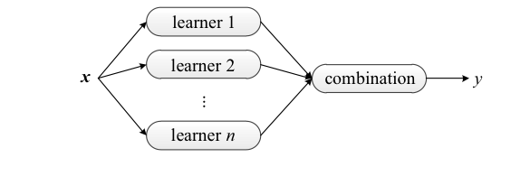

### Train Test Split


```python
# Train and Test Split
train_X, test_X, train_y, test_y = train_test_split(X_train_sparse, y_train, test_size=0.2, random_state=144)
```

### LGBM
***


```python
model_lgb = lgb.LGBMRegressor(num_leaves=31, n_jobs=-1, learning_rate=0.1, n_estimators=500, random_state=42)
model_lgb.fit(train_X, train_y)

# Predict with LGBM Model
lgbm_y_pred = model_lgb.predict(test_X)
```


```python
lgbm_rmsle = get_rmsle(lgbm_y_pred, test_y)

print(f'LGBM RMSLE: {lgbm_rmsle:.5f}')
```

    LGBM RMSLE: 0.48843


### Ridge Regression
***


```python
model_ridge = Ridge(solver = "lsqr", fit_intercept=True, random_state=42)
model_ridge.fit(train_X, train_y)
    
# Evaluate Training Score
ridge_y_pred = model_ridge.predict(test_X)
```


```python
ridge_rmsle = get_rmsle(ridge_y_pred, test_y)

print(f'Ridge RMSLE: {ridge_rmsle:.5f}')
```

    Ridge RMSLE: 0.54423


### Ensemble Model
***


```python
ensemble_y_pred = (lgbm_y_pred+ridge_y_pred)/2

ensemble_rmsle = get_rmsle(ensemble_y_pred, test_y)

print(f'Ensemble RMSLE: {ensemble_rmsle:.5f}')
```

    Ensemble RMSLE: 0.50599


# Save the models to disk
***


```python
import pickle

modelList = [(model_lgb, 'Lgb.sav'),
            (model_ridge, 'RidgeRegression.sav')]

for model, filename in modelList:
    pickle.dump(model, open("../models/"+filename, 'wb'))
```

# Predictions on Kaggle Test data
***

<a id = 'ridgePred'></a>
### Predictions by Ridge
***


```python
ridge_kaggle_y = model_ridge.predict(X_test)
```


```python
# inverse log transformation
submission["price"] = np.expm1(ridge_kaggle_y)
```


```python
# first submission file
submission.to_csv('../submissions/submission_ridge.csv',index=False)
```

<a id = 'lgbmPred'></a>
### Predictions by LGBM
***


```python
lgbm_kaggle_y = model_lgb.predict(X_test)
```


```python
# inverse log transformation
submission["price"] = np.expm1(lgbm_kaggle_y)
```


```python
# second submission file
submission.to_csv('../submissions/submission_lgbm.csv',index=False)
```

<a id = 'ensemblePred'></a>
### Predictions by Ensemble
***


```python
ensemble_y_kaggle = (lgbm_kaggle_y+ridge_kaggle_y)/2

# inverse log transformation
submission["price"] = np.expm1(ensemble_y_kaggle)

# third submission file
submission.to_csv('../submissions/submission_ensemble.csv',index=False)
```

# Conclusion
***
I have reached the end of the notebook here. In this notebook, apart from the Exploratory Data Analysis, I have explored various techniques to preprocess text and use it as features in a predictive model. I have made use of the python package Eli5 to understand which words have been influential in determining the price of the products. I have also built predictive models using Ridge Regression, Light GBM and the ensemble of both the models to predict prices of the products sold in Mercari. The best rmsle score I achieved is 0.48843.<br>
Also, this notebook is a work in progress and I will keep on updating the notebook with time.
